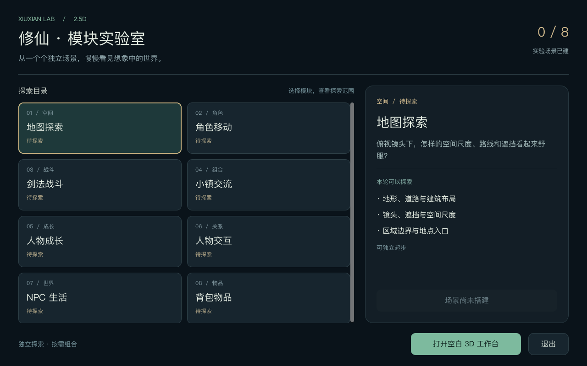
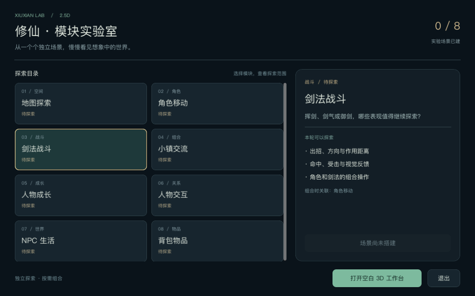
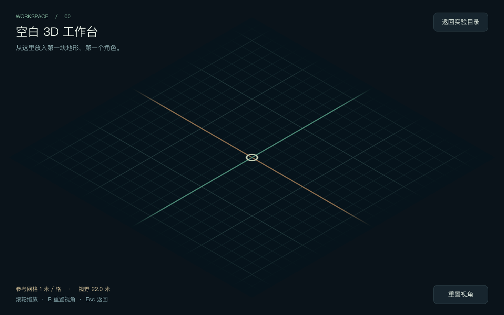

# 空工程初始化验收

日期：2026-09-17。环境：macOS / Apple M4 Pro / Godot 4.6.stable / Compatibility。

## 范围

验收实验目录、八项计划的真实状态、空白 3D 工作台、场景进出与基础操作。地图、角色、剑法、人物与背包模块均未实现，不以工作台或清单条目计为玩法完成。

## 基础检查

- Godot 首次导入成功，主入口 headless 启动成功。
- Tier 0 的 12 个检查项全部通过；27 个负向控制通过。
- 70 条运行时断言通过、0 失败：模板原有 47 条 + 实验目录契约 23 条。
- 模板核心七个 GDScript 与基线逐字节一致；新运行时没有旧修仙工程路径引用。
- 七个 Agent 入口均为有效相对符号链接。
- `run.command` 的 shell 语法与帮助正常；从 `/tmp` 使用绝对路径启动空白工作台成功，验证脚本不依赖调用目录。

完整检查输出：[bootstrap-checks.txt](2026-09-17-bootstrap-checks.txt)。

## 实际渲染与输入

在实际 OpenGL / Metal Compatibility 渲染进程中运行 `src/tests/lab_playtest.gd`，通过真实 InputEvent 流发送按键与滚轮事件。脚本先等待 SceneTree 初始化完成，再加载真实场景；没有使用测试替身替换入口或工作台。

通过项：

- 主入口进入真实场景树，显示八个模块；初始为 0 / 8 场景已建。
- 待探索模块的运行按钮禁用。
- 键盘激活「剑法战斗」后详情更新，并显示「角色移动」依赖。
- 从入口打开工作台，相机为 current 的正交 Camera3D。
- 滚轮改变视野；R 恢复初始视野。
- Esc 与返回按钮均可回到实验目录；返回后计划状态保持真实。
- 默认 1280×800 与 960×640 窗口下检查截图：文字、条目与操作按钮可见，没有重叠。小窗口按 16:10 等比适配，因此保存的内容帧为 960×600。

脚本结束输出：`PLAYTEST 完成：失败 0`。

复现截图验收（从工程根执行，将输出前缀替换为本机绝对路径）：

```sh
godot --path src --script res://tests/lab_playtest.gd -- --capture-prefix=/absolute/path/bootstrap
```

## 截图







## 边界

本轮验证工程与界面能够正确运行。工作台没有角色、地形关卡、物理移动、战斗或 NPC；1 米网格与相机只是后续实验的基底。美术方向、控制手感和各模块规则由后续独立实验决定。
