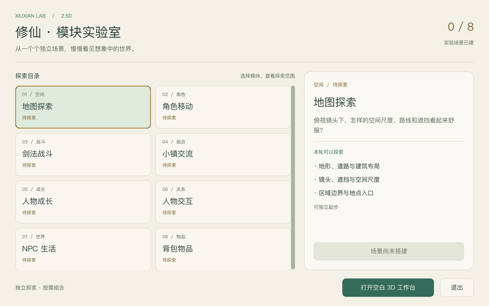
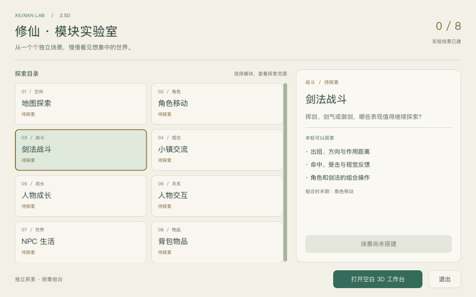
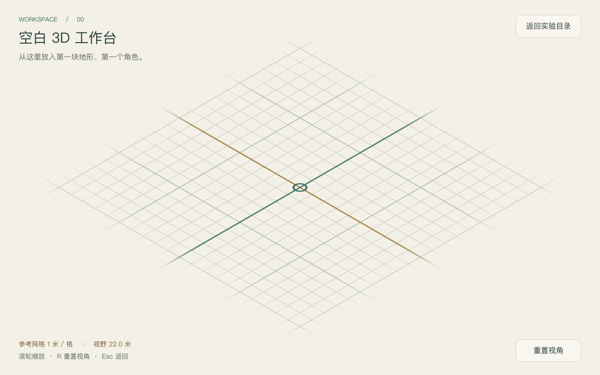

# 纸白 · 青绿配色验收

日期：2026-09-17。关联决策：[统一配色](../../notes/implemented/art/2026-09-17-paper-jade-palette.md)。

## 变更范围

实验目录、模块卡片、详情面板、按钮各状态、文字、滚动条与提示气泡统一采用浅色 Theme。空白 3D 工作台同步更换环境背景、参考地面、网格和坐标轴颜色。动态卡片与场景文字改用 Theme 变体；模块状态和操作逻辑不变。

主色：纸白 `#F3F0E7`、象牙 `#FAF8F2`、墨绿 `#253D36`、青绿 `#356B5A`、状态暖金 `#7B5E2D`。焦点线采用较亮的铜金 `#A27A3B`，与浅青选中底区分。

## 运行结果

环境：macOS，Apple M4 Pro，Godot 4.6.stable.official.89cea1439，OpenGL Compatibility / Metal。

- `python3 tools/verify/run_all.py --with-tests`：12 项 Tier 0 门禁、27 个负向控制、70 条运行时断言全部通过。完整输出见 [checks.txt](2026-09-17-paper-jade-checks.txt)。
- 运行既有 `res://tests/lab_playtest.gd`：真实创建窗口、渲染、键盘选择模块、进入工作台、滚轮缩放、R 重置、Esc 返回和返回按钮全部通过；15 个检查（其中 3 个为截图保存）无失败。输出见 [render.txt](2026-09-17-paper-jade-render.txt)。
- 检查 1280×800 与 960×640 窗口。小窗口因固定 16:10 视口，截图内容为 960×600；标题、详情、按钮和选中状态可见，模块区可滚动。
- 人工观察截图：纸色背景与 3D 地面衔接，没有矩形底色接缝；网格可辨认，青绿与铜金轴线更清楚；正文、次级说明、选中状态和禁用入口层次清楚。
- 按最终色值计算对比度：正文／纸白约 10.24:1，主按钮文字／青绿约 5.95:1，次级文字／浅青选中底约 4.64:1，暖金状态文字／浅青选中底约 4.83:1。此项只检查这些文字配对，不代表完整无障碍认证。

本轮没有新增外观单元测试；复用现有验证脚本。首次门禁发现 UI Theme 名称使用了项目保留给公共词汇的 StringName 字面量；已改为与现有按钮变体一致的普通样式名称，重新运行全部检查通过。

## 实际画面

1280×800 实验目录：

小窗口选择剑法模块：

空白 3D 工作台：

