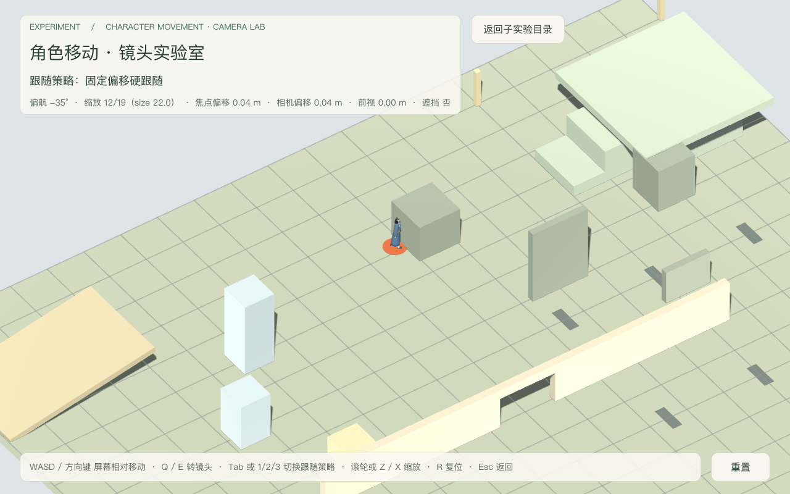
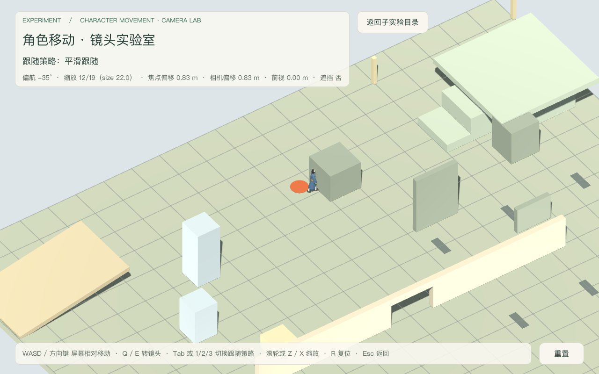
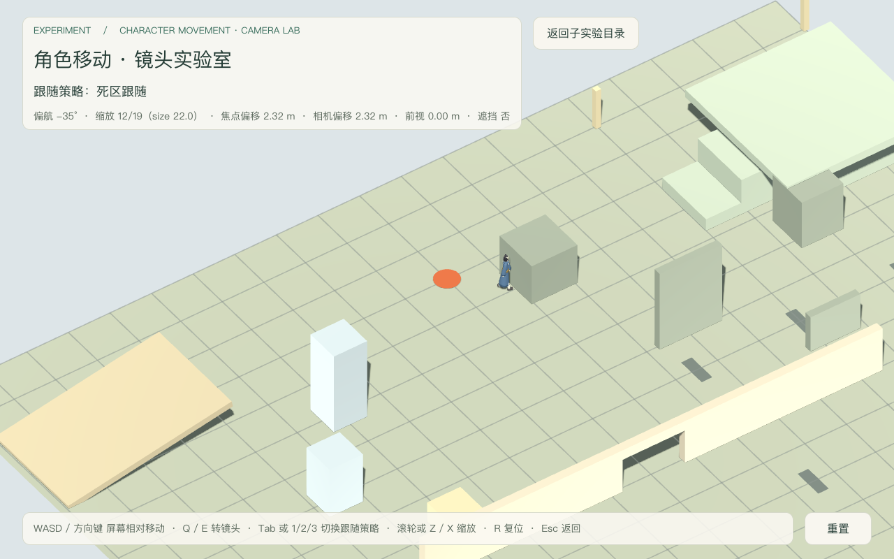
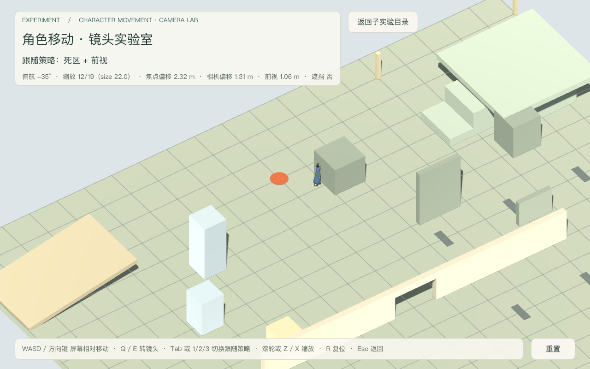
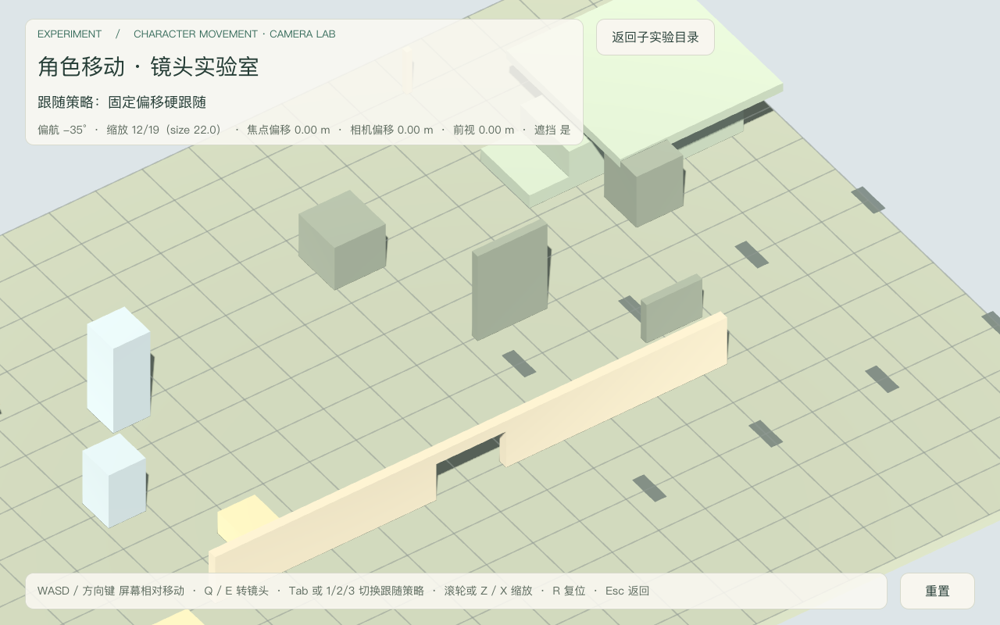
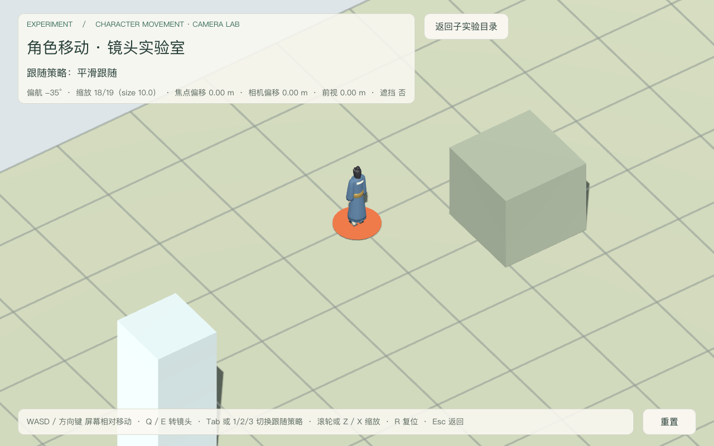
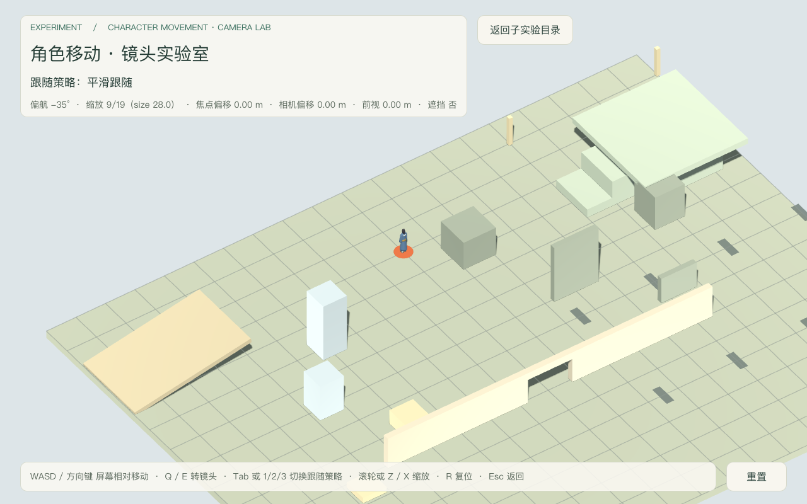

# 镜头实验室验收（2026-09-18）

场景：`res://levels/experiments/character_movement/camera_lab.tscn`（可直接单独启动；`--path src --script res://tests/camera_lab_playtest.gd` 无头 / 窗口两档验收）。
决策依据：[character-movement-subexperiments](../../notes/implemented/gameplay/2026-09-18-character-movement-subexperiments.md)（子实验「镜头实验室」行）。
执行：CLI 档（编辑器桥不可用，见下）。

## 最终摘要

- 镜头实验室无头验收（**阶段快照**）：**89 项 PASS / 0 FAIL**，stderr **0 字节**（`headless.log` / `headless.err`）。
  这是 `MovementLabInput` 抽取**之前**的实测数字，原样保留、不改写。
- 窗口截图：**9 张**全部入仓（`2026-09-18-camera-lab-*.png`），保存前打印 `SNAPSHOT` 运行时读数（模式 / 相机 transform / 角色位移 / 焦点偏移 / 前视 / 缩放）。
- 四模式同段输入对照：硬跟随 lag 0.000 m、平滑 0.826 m、死区 2.315 m、死区+前视相机瞄准点落后 1.31 m（前视 1.063 m）——四者相机位姿互不相同。
- 跨套件计数不在本报告重复：本报告只对镜头实验室自身**阶段快照**的 **89 / 0** 负责；其余套件的最终集成口径一律以 [character-movement-subexperiments](2026-09-18-character-movement-subexperiments.md) 为准，本报告不复制其数字，以免并行口径漂移。
- **集成后的镜头实验室计数为 101 / 0**（`MovementLabInput` 抽取与透传断言之后的现状），同样以该权威报告的「镜头实验室」行为准；本报告的 89 是阶段快照，不是当前值。
- 开发期快照（**非最终、不入结论**）：本实验开发过程中曾跑到运行时单测 177 / 0、庭院 33 / 0、群山 217 / 0；这些数字对应各自当时的中间工作区状态，与后续并行代理改动不在同一提交状态，仅作为「本实验未破坏既有套件」的过程记录，不得当作最终计数引用。
- Tier 0 门禁：全部通过，负向控制 **27/27**（`gates.log`）。

## 编辑器桥状态（为何走 CLI 档）

按 godot-ai-orchestration 先发现会话：

1. MCP 端点在线：`http://127.0.0.1:8000/mcp` 完成 `initialize` 握手，服务 `Godot AI 3.4.7`。
2. `session_manage(op="list")` → `{"sessions":[],"count":0}`。
3. `editor_state` → `PLUGIN_DISCONNECTED / reason=no_active_session`（编辑器进程存在但插件未连接到该服务器实例）。

结论：桥不可用，按 skill 的 CLI 档执行——全部证据来自 `Godot --headless` 状态断言与窗口模式截图，未依赖任何 MCP 工具。

## 五问分类

| 验收项 | 1 已实现 | 2 已运行通过（命令 + 日志） | 3 静态检查 | 4 未验证 | 5 外部阻塞 |
|---|---|---|---|---|---|
| A1 场景独立装配（角色 / 组件 / 相机 / 台架） |  | ✔ 89/0（阶段快照） |  |  |  |
| A2 灰盒七类几何齐备（网格 / 标尺 / 墙+门洞 / 遮挡 / 高低柱 / 坡 / 高台） |  | ✔ 按节点身份断言 |  |  |  |
| A3 门洞真可通行（两侧墙段留空 + 过梁） |  | ✔ |  |  |  |
| A4 角色保持三能力（Jump / SwordFlight / SwordsmanMovement） |  | ✔ 运行时读回装配 | ✔ 未引用具体能力类名 |  |  |
| A5 HUD 控制说明列出四个模式切换键（1/2/3/4 + Tab） |  | ✔ 运行时读回 Controls 文案 |  |  |  |
| M1 硬跟随：移动中焦点 == 角色位置 |  | ✔ lag 0.000 m |  |  |  |
| M2 平滑跟随：移动中落后、停下收敛 |  | ✔ 0.826 m → 0.036 m |  |  |  |
| M3 死区：区内不动、越界拖动、无前视 |  | ✔ 0.000 / 2.315 / 0.000 m |  |  |  |
| M4 死区+前视：前视非零且相机瞄准点落后减小 |  | ✔ 1.063 m 前视；4.449 → 1.31 m |  |  |  |
| M5 四模式相机位姿互不相同（真比较对象） |  | ✔ 两两距离 > 0.2 m |  |  |  |
| M6 真实按键切模式（1/2/3/4 + Tab 循环） |  | ✔ 逐个读回 |  |  |  |
| S1 偏航 0/55/140/-95° 下地面基与真实相机 basis 一致 |  | ✔ 四组 dot=1.000 |  |  |  |
| S2 转镜头后 W/D 位移沿相机地面前 / 右 |  | ✔ dot ≥ 0.95 |  |  |  |
| S3 转镜头后角色朝向跟随相机基 |  | ✔ |  |  |  |
| Z1 滚轮 / Z / X 缩放 |  | ✔ size 22→20→24→22→24 |  |  |  |
| Z2 缩放真实改变取景（屏幕投影） |  | ✔ 22.3 → 25.6 px |  |  |  |
| Z3 缩放限幅 zoom_min / zoom_max |  | ✔ 8.0 / 44.0 |  |  |  |
| P1 切全部策略后三能力装配不变 |  | ✔ 名字与子节点数一致 |  |  |  |
| P2 切模式不产生 sword_flight_block 残留 |  | ✔ count=0 |  |  |  |
| P3 切模式不改角色物理参数（8 项导出值） |  | ✔ 快照相等 |  |  |  |
| P4 切模式时角色仍按 move_speed 移动 |  | ✔ 四种模式均 4.00 m/s |  |  |  |
| P5 单物理提交点 |  | ✔ | ✔ 仅 actor 一处 move_and_slide |  |  |
| P6 实验脚本不写 velocity / 意图 / 能力状态 |  | ✔ 正则扫描 3 个脚本 |  |  |  |
| R1 R 复位角色 / 偏航 / 焦点 / 缩放 |  | ✔ |  |  |  |
| R2 Esc 返回 movement_lab_hub |  | ✔ 实际 `MovementLabHub` |  |  |  |
| R3 返回后 MSAA 恢复进入前值 |  | ✔ |  |  |  |
| V1 硬跟随截图（焦点压实角色） |  | ✔ hard-moving |  |  |  |
| V2 平滑 / 死区 / 前视对照截图（同段输入） |  | ✔ smooth / deadzone / lookahead-moving |  |  |  |
| V3 遮挡取证（HUD 遮挡=是，角色被板体挡住） |  | ✔ occluded vs open 对照 |  |  |  |
| V4 缩放对照（近 / 远） |  | ✔ zoom-near / zoom-far |  |  |  |
| V5 小窗 960×640 不溢出 |  | ✔ small |  |  |  |
| V6 画面可读性（HUD 文字 / 灰盒层次 / 焦点标记） |  |  | ✔ 人工查看 9 张 |  |  |
| H1 跟随舒适度 / 前视手感 / 缩放手感 / 遮挡可接受度 |  |  |  | ✔ 需使用者试玩 |  |

## 命令与日志

原始日志在 `~/.cache/game-xiuxian-lab/camera-lab/`（不入仓）：

| 证据 | 命令 | 结果 |
|---|---|---|
| 无头验收（阶段快照） | `Godot --headless --path src --script res://tests/camera_lab_playtest.gd` | `headless.log`：89 PASS / 0 FAIL；`headless.err` 0 字节（抽取前的实测，当前 101/0 见集成报告） |
| 截图 9 张 | `Godot --path src --script res://tests/camera_lab_playtest.gd -- --capture-prefix=<abs>` | `capture.log` 全 PASS，`SNAPSHOT` 逐张打印 |
| Tier 0 + 负向控制 | `python3 tools/verify/run_all.py` | `gates.log`：门禁全部通过，27/27 |
| 运行时单测 | `Godot --headless --path src tests/test_runner.tscn` | `units.log`：开发期快照 177 / 0（**非最终**，最终口径见集成报告） |
| 庭院回归 | `Godot --headless --path src --script res://tests/character_movement_playtest.gd` | `garden.log`：开发期快照 33 / 0（**非最终**，最终口径见集成报告） |
| 群山回归 | `Godot --headless --path src --script res://tests/mountain_traversal_playtest.gd` | `mountain.log`：开发期快照 217 / 0（**非最终**，最终口径见集成报告；stderr 仅掉出回收用例的预期 WARNING） |
| 独立启动 | `Godot --headless --path src --quit-after 90 res://levels/experiments/character_movement/camera_lab.tscn` | `standalone.log`：exit 0，stderr 0 字节 |

## 四模式实测读数（同段输入，截图前 SNAPSHOT）

| 模式 | 相机位置 | 角色位置 | 焦点 | 焦点落后 | 前视 |
|---|---|---|---|---|---|
| 硬跟随 `hard` | (-5.89, 10.71, 0.39) | (0.93, 0, -9.35) | (0.93, 0, -9.35) | 0.000 m | 0.000 m |
| 平滑 `smooth` | (-5.67, 10.72, 0.73) | (1.55, 0, -8.28) | (1.15, 0.01, -9.01) | 0.826 m | 0.000 m |
| 死区 `deadzone` | (-6.82, 10.71, -0.26) | (1.55, 0, -8.28) | (0, 0, -10) | 2.315 m | 0.000 m |
| 死区+前视 `lookahead` | (-6.33, 10.71, 0.68) | (1.55, 0, -8.28) | (0, 0, -10) | 2.315 m | 1.063 m |

偏航与缩放四张完全一致（`yaw=-35`、`zoom=22.0`）：唯一变量是跟随策略。

## 实际画面

人工观察（自动检查不替代）：HUD 在 1280×800 与 960×640 下均完整、未遮主要区域；纸白信息面板在灰盒背景上文字可读；橙色焦点圆盘与角色位置的关系可直接目测（硬跟随压实、前视时角色位于焦点前方）；遮挡对照中角色确实被 4 m 板体挡住，HUD 同时读到「遮挡 是」。

## 设计取舍（本实验内，未抽 core）

- 四策略共享同一偏航 / 俯角 / 距离 / 缩放，只变跟随判据；`DEADZONE` 与 `LOOKAHEAD` 成对存在，用来单独读出「前视」这一项的贡献。
- 「焦点」与「相机瞄准点」分开读回：前视只平移相机瞄准点、不改变死区焦点，因此比较落后必须读 `camera_focus`，否则会把前视误判成无效果。
- 死区只在水平面生效，竖直方向直接跟随：避免高台被死区拖成高度错觉。
- 平滑与前视的时间常数用 `1 - exp(-dt/tau)`，与帧率无关，便于后续换帧率复现。
- 相机地面基由台架按偏航角给出，与真实 `Camera3D` basis 水平投影逐帧对照（四组偏航 dot=1.000）；场景以它调用 `set_camera_ground_basis()`，不写角色意图字段。

## 已知限制

- 未做镜头遮挡规避（自动抬升 / 推开 / 半透明化）：本实验只**观察并读回**遮挡（射线 + HUD），规避策略是后续待比较项。
- 无鼠标拖拽旋转与右键平移；旋转只由 Q / E 键驱动，便于无头测试稳定复现。
- 灰盒为程序化 BoxMesh，无美术资产；不含完整地图、战斗或 NPC。
- 本报告成文时 `camera_lab` 尚未接入子实验清单，现由目录代理完成（见下「集成状态」）。

## 集成状态（由目录代理完成，本代理未改其文件）

1. `src/data/content/character_movement_subexperiments.json`：`camera_lab` 已为 `exploring`，`scene` = `res://levels/experiments/character_movement/camera_lab.tscn`。
2. `movement_lab_hub.tscn`（`MovementLabHub` 根节点）已接线，本场景 Esc 目标与之一致；集成运行的进入 / 返回路径结论见 [character-movement-subexperiments](2026-09-18-character-movement-subexperiments.md)。
3. 集成后的本场景计数为 **101 / 0**，以该权威报告的「镜头实验室」行为准；本报告摘要里的 **89 / 0** 是 `MovementLabInput` 抽取前的阶段快照。

## 未通过项与归因

无未通过项。开发过程中修复的 5 处均为本实验自身缺陷（HUD 格式占位符不匹配、静态扫描正则过宽误报、缩放取景测量点选在拉远之后、前视落后读错字段、切场景后访问已释放 viewport），已在实现中修正；角色、Capability 与既有庭院 / 群山资产未受影响。
