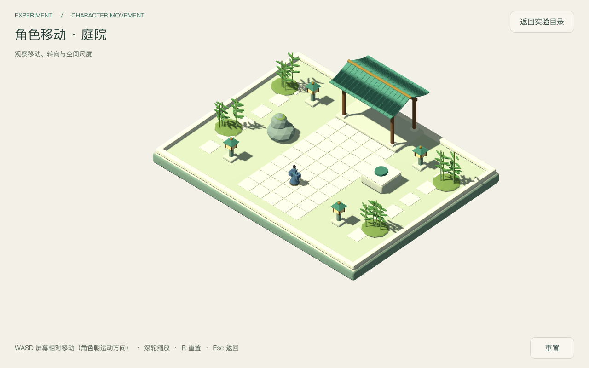
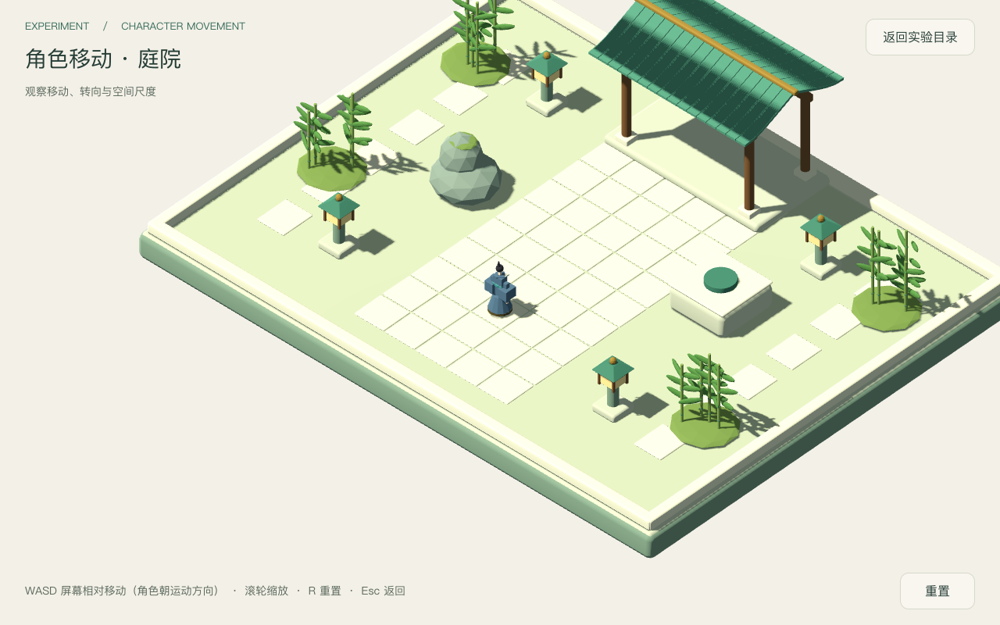
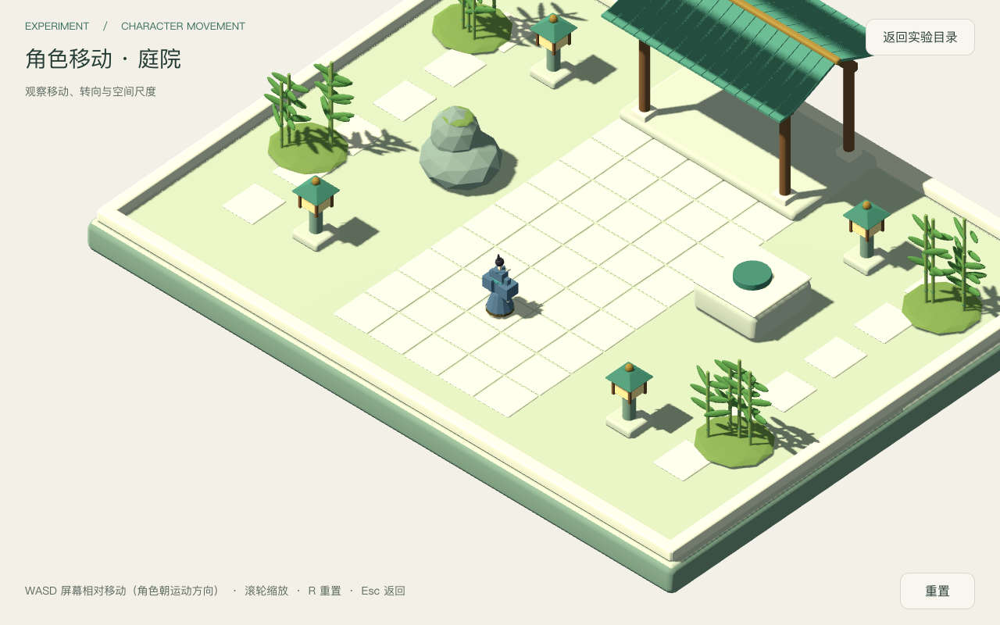

# 角色移动庭院验收（纯移动）

日期：2026-09-18。场景：`res://levels/experiments/character_movement/movement_garden.tscn`。
关联决策：[character-movement-garden](../../notes/implemented/gameplay/2026-09-18-character-movement-garden.md)。
本轮只为验证跑通与取证，不改玩法：首场景无攻击输入、无战斗装配，剑法无运行入口。

## 变更范围（本轮）

- `src/tests/character_movement_playtest.gd`：重写为可运行调用链验收。补 A/S 方向、松键停止、鼠标不产生位移／速度、逐碰撞体身份断言、无战斗语义节点、目录入口硬断言。
- `src/levels/experiments/character_movement/movement_garden.tscn`：环境与灯光（最终值）。sun energy `1.0 → 0.35`，ambient `0.65 → 0.25`（source 改为 Color），`tonemap_mode = 2`（Filmic）+ `tonemap_white = 1.0`。抑制石板／台基过曝。
- `src/levels/experiments/character_movement/movement_garden.gd`：进入场景时保存并设置 `viewport.msaa_3d = MSAA_4X`，`_exit_tree()` 恢复进入前的值（共享根视口，避免泄漏到目录等其他场景），消除细碎锯齿。模型与 GLB 未改。

## 五档证据

1. **静态**：`movement_garden.tscn` 环境/灯光参数、`movement_garden.gd` 的 MSAA 与移动编排、`swordsman.gd` / `swordsman_movement.gd` / `swordsman_motion_component.gd` 五函数能力实现；`swordsman.tscn` 只挂 `SwordsmanMovement`。
2. **单元测试**：`Godot --headless tests/test_runner.tscn` → 6 套件 **通过 87 / 失败 0**（含 `test_swordsman_movement.gd` 通过 17 / 失败 0）。日志 `~/.cache/game-xiuxian-lab/tests.log`。
3. **集成测试（无头，真实物理）**：`Godot --headless --script res://tests/character_movement_playtest.gd` → **32 项全 PASS**，失败 0（含 MSAA 返回后恢复）。日志 `~/.cache/game-xiuxian-lab/playtest-headless.log`。
4. **渲染截图（窗口模式）**：`Godot --script res://tests/character_movement_playtest.gd -- --capture-prefix=<abs>` → 4 张 PNG 保存成功，进程 exit 0。首张截图前有界等待 48 个真实渲染帧（`_wait_render_frames`），避免字形未上传导致 HUD 文字整层缺失；4 张已人工确认标题、状态、操作说明与按钮文字均存在。日志 `~/.cache/game-xiuxian-lab/capture-window.log`。
5. **门禁与目录回归**：`verify-scenes`（6 目标合规）、`verify-packages`（2 目标）、`verify-capabilities`（1 目标）、`verify-component-purity`（1 目标）全部 OK；`lab_playtest.gd` hub 回归 **13 项全 PASS**（日志 `~/.cache/game-xiuxian-lab/lab-playtest.log`）。

## 断言覆盖（集成测试 32 项）

- 装配：场景可加载、角色与庭院均含 Blender 导入网格、角色子树无战斗语义节点（slash/attack/hitbox/hurtbox/damage/projectile，`Swordsman*` 历史命名不误判）、唯一能力为 `SwordsmanMovement`。
- 方向与转向：D → 屏幕向右位移；A → 朝相机左方移动并转向左；W → 相机地面前方速度；S → 相机地面后方速度；停下保留朝向。
- 停止与失焦：松键速度归零、松 A 停止、失焦清除输入。
- 斜向限速：W+D 同按速度 ≤ move_speed（4.0）。
- 静态碰撞（逐个断言命中体身份，非任意碰撞）：
  - `Boundaries/East`（z=+4 专用通道）、`Boundaries/West`、`Boundaries/South`、`Boundaries/North`；
  - `Obstacles/Obstacle1`（学者石 −4,0,0）、`Obstacles/Obstacle2`（禅石 4,0,−1）。
- 鼠标无攻击：移动与左键不改变朝向、不产生位移、不产生速度。
- 重置与退出：R 回到初始位置、Esc 返回 LabHub；返回后共享根视口 `msaa_3d` 恢复为进入前的值。
- 目录入口：experiments.json 的 `character_movement.scene` 等于本场景且可被 `LabCatalog.can_open` 打开；`sword_combat` 保持 `planned`、无入口。

碰撞断言首次运行暴露真实问题：从原点向 ±X sweep 时先撞到障碍而非边界，改为 z=+4 通道后分别命中 East/West；障碍测试从其正面外 2~3 米朝本体 sweep，删除任一碰撞体会让对应断言失败，不再被远处边界兜底。

## 实际画面

庭院全景 1280×800：

角色近景 1280×800（相机 size 16，滚轮缩放等效）：

更近的 size 14：

小窗口 960×600（固定 16:10 视口）：

人工观察：石板接缝与台基层次在最终曝光下可见；角色为蓝袍修士，近景可辨发髻、交领与腰带轮廓；HUD 两尺寸均未遮挡行动区域。

对最终截图同一裁剪区做像素统计（排除上下 HUD 带）：garden / character-near / small 三张的**纯白像素（R,G,B ≥ 250）占比均为 0.0%**，中位亮度 238 / 227 / 238，p95 约 249。即地面与台面不再出现 (255,255,255) 大片饱和，最深像素未被压死（全帧 crushed <20 占比 0.0%）。

## 已知限制

- 角色为静态网格，无走路动画；移动时不做程序步行动作（本轮未新增表现）。
- 装饰性石灯与竹亭暂无碰撞体，仅两个障碍代理与四周边界参与静态碰撞。
- 手感与配色审美需使用者实机判断，自动化证据不代替主观评价。
- 960×640 窗口请求实际渲染 960×600（项目固定 16:10 视口），与既往验收一致。

## 最终集成检查

对应 2026-09-18 本轮未提交工作区（包含决策迁移、模型接入及最终灯光）。主代理执行 `python3 tools/verify/run_all.py --with-tests`：Tier 0 全部通过，负向控制 27/27，运行时测试 87/87；`git diff --check` 通过。原始日志位于 `~/.cache/game-xiuxian-lab/final-checks.log`。

截图预热通过绘制回调计数，在 process_frame 轮询截止时间，超时显式失败；不直接等待可能不再发出的绘制信号。
