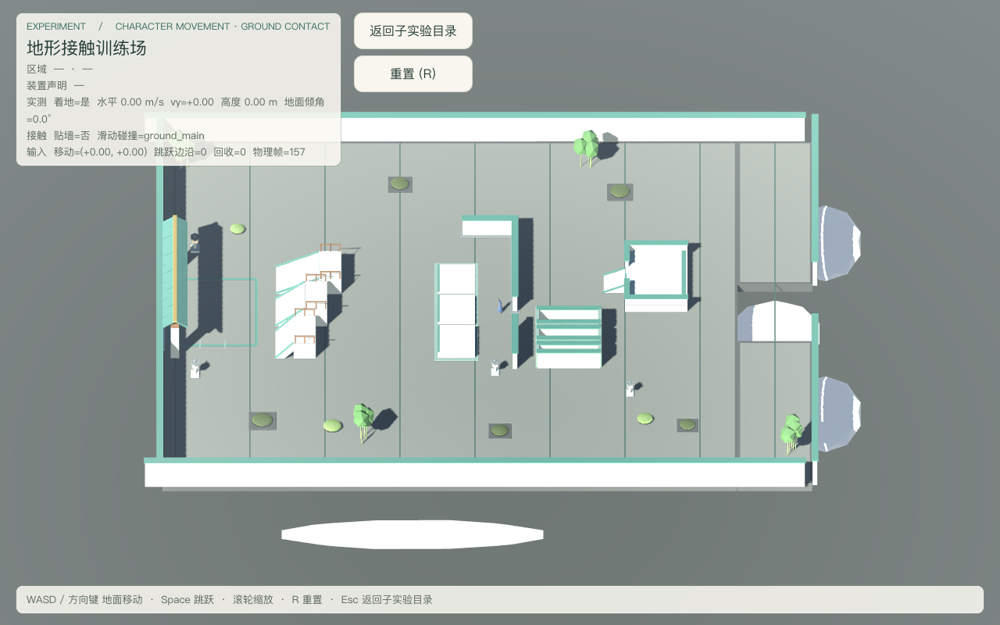
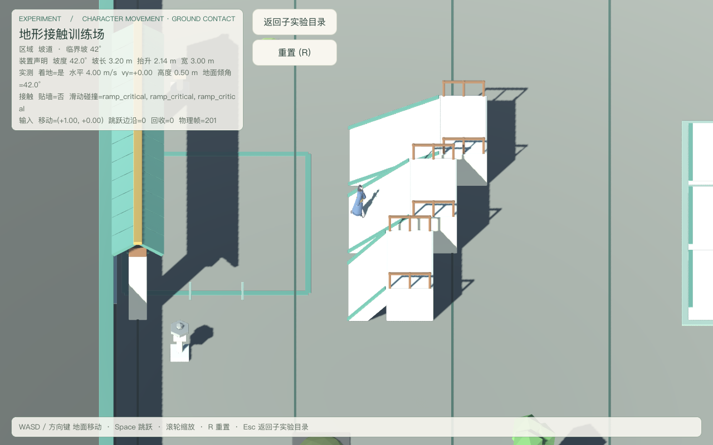
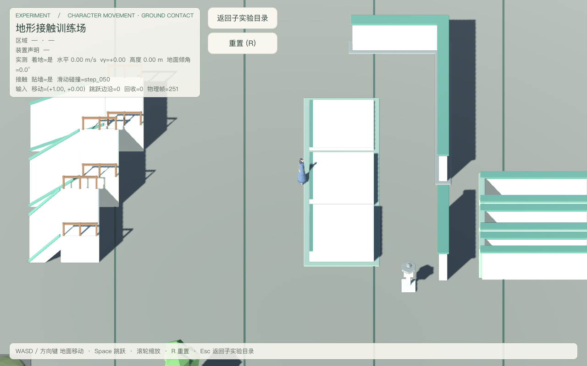
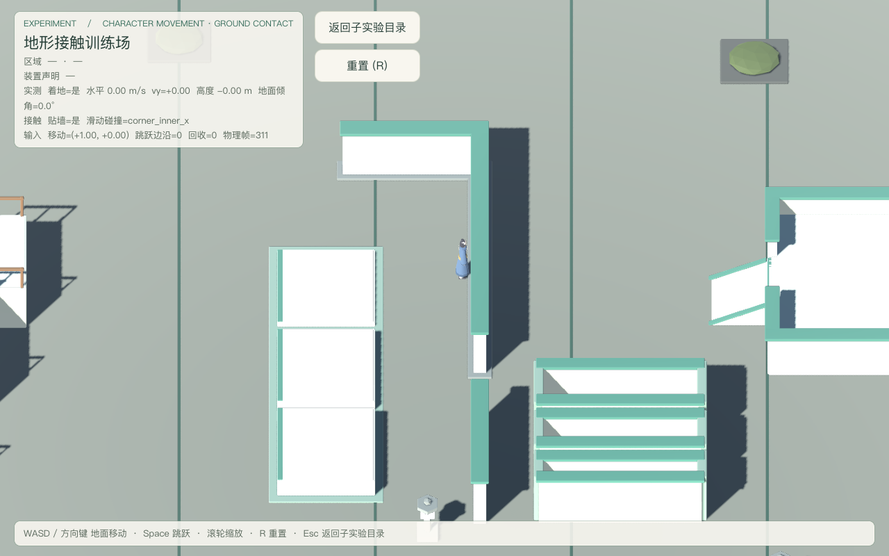
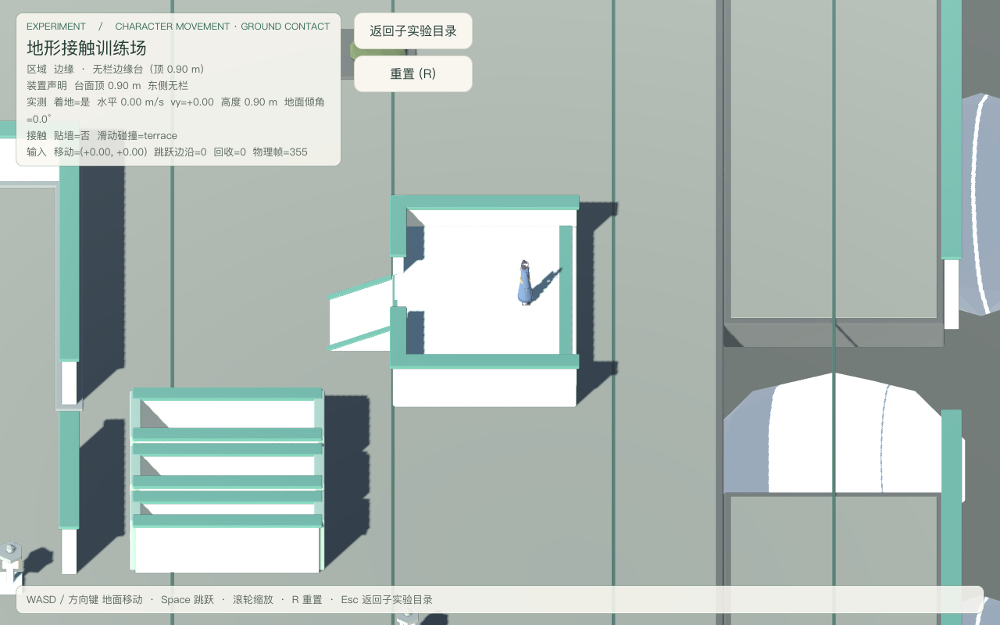
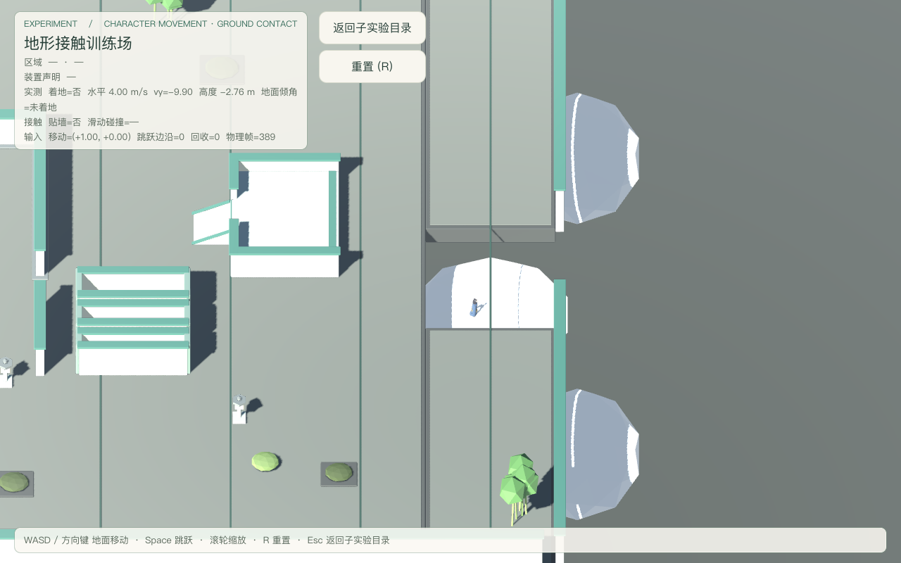
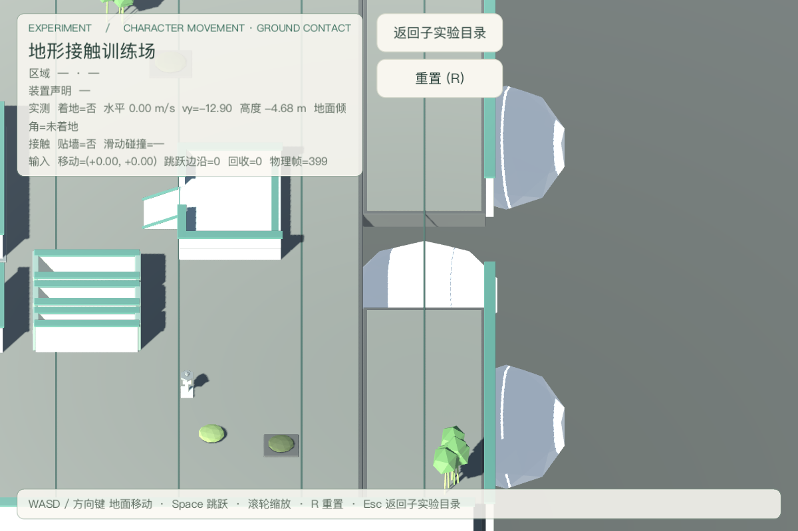

# 地形接触训练场验收（2026-09-18）

场景：`res://levels/experiments/character_movement/ground_contact_course.tscn`（子实验「地形接触训练场」，返回目标固定为同目录 `movement_lab_hub.tscn`）。
决策依据：[character-movement-subexperiments](../../notes/proposed/gameplay/2026-09-18-character-movement-subexperiments.md)；三能力契约 [traversal-contract](../experiments/traversal-contract.md)。
验收档：**CLI 档**（`godot --headless` + 窗口模式截图；编辑器桥未用于本轮，不构成依赖）。
本轮开发基线：`852308d`（`Extract movement lab input state`）。

## 最终摘要

- 训练场验收：**178 PASS / 0 FAIL**，stderr 5 行（全部是落下回收用例主动走进竖井触发的预期 WARNING，见下）。
- 运行时单元套件：**260 通过 / 0 失败**（10 套件，含并行任务的 hub 49 与 input helper 82）。
- Tier 0 门禁 + 负向控制：全部通过，负向控制 **27/27**。
- 截图 7 张入仓 `docs/playtest/`；坡道 / 台阶 / 墙角 / 窄路 / 边缘的位移全部由真实按键产生。
- 仍为 **3 个 Capability**；`move_and_slide` 全仓仍只有 actor 根一处。
- 装置可视几何与碰撞盒逐项对齐：**29 / 29**（机械断言，非人工看图）。

## 五问分类

| 矩阵 ID | 1 已实现 | 2 已运行通过（命令 + 日志） | 3 静态检查 | 4 未验证 | 5 外部阻塞 |
|---|---|---|---|---|---|
| A1 三能力装配与唯一物理提交点 |  | ✔ 角色恰 3 能力；能力脚本 0 处 `move_and_slide` | ✔ actor 根 1 处；场景 0 处 |  |  |
| A2 场景只经公开输入 API |  |  | ✔ 7 个 API 全在；无 velocity / 意图 / 能力类名 / 五函数轴 |  |  |
| A3 场景不改 actor 物理属性 |  |  | ✔ 8 个属性（floor_max_angle 等）均未出现 |  |  |
| A4 使用 MovementLabInput |  | ✔ helper 自带套件 82/82 | ✔ helper 不依赖 Swordsman / Capability / Camera |  |  |
| A5 布局 → 碰撞一致性 |  | ✔ 29 装置 ↔ 29 碰撞体，逐 id 可寻址 | ✔ 六分区齐备 |  |  |
| A6 可视几何 ↔ 碰撞盒对齐 |  | ✔ 逐装置 AABB 关键尺寸比对 29/29 |  |  |  |
| F1 平地基线 |  | ✔ 4.00 m/s、无漂移、实测倾角 0.0°、D 沿相机右方 |  |  |  |
| R1 缓坡 28° |  | ✔ 真实走顶、Δy=1.76 m、实测 28.00° |  |  |  |
| R2 临界坡 42° |  | ✔ 真实走顶、Δy=2.00 m、实测 42.00° |  |  |  |
| R3 陡坡 52° |  | ✔ 顶不上去（Δy=−0.02）、真实被挡在半途 |  |  |  |
| R4 坡上停住 |  | ✔ 松键后 Δ=0.000 m、仍贴地 |  |  |  |
| S1 台阶 0.25 / 0.50 / 0.75 步行 |  | ✔ 三级都**被挡**（Δy=0.00）、停在踏面前 0.35 m 不穿透 |  |  |  |
| S2 台阶起跳 |  | ✔ 三级都能跳上，落地高度 0.251 / 0.501 / 0.751 = 声明抬升 |  |  |  |
| S3 台面承重 |  | ✔ 站上后停稳不下沉 |  |  |  |
| C1 内角墙 |  | ✔ 停在墙面外一个半径（x=5.65 / 墙面 6.00）、停稳 Δ=0.000、接触对象=墙本体 |  |  |  |
| C2 凹角 |  | ✔ x 向被挡、最大漂移 0.000 |  |  |  |
| C3 斜向顶墙滑动 |  | ✔ 沿墙 Δz=1.25 m、不穿透（x=5.65 < 6.00）、贴墙一个半径 |  |  |  |
| C4 外墙角绕行 |  | ✔ 凸角不卡死（x=7.13 > 墙角 6.20）、全程着地 |  |  |  |
| N1 窄路 1.2 / 0.9 m |  | ✔ 真实走过通道（Δx > 3.5 m）、未偏出、全程着地 |  |  |  |
| N2 窄路 0.6 m |  | ✔ 窄于角色直径 0.70 m，无法穿过（Δx < 1.6 m） |  |  |  |
| E1 经登台坡上台 |  | ✔ 走上 0.90 m 台面、区域读数=terrace |  |  |  |
| E2 无栏边缘走出 |  | ✔ 离地 → 落回下层 → 重新着地、确实越过台缘 |  |  |  |
| E3 边缘停住 |  | ✔ 台面上停住不下落（Δ=0.000、y 仍 0.90） |  |  |  |
| V1 落下回收 |  | ✔ 计入回收计数、回出生点、无御剑阻塞残留 |  |  |  |
| H1 HUD 读数 |  | ✔ 区域 / 声明 / 实测 / 接触 / 回收五组文本实读 |  |  |  |
| H2 区域随位置变化 |  | ✔ 平地 → 台面 文案变化且含装置名 |  |  |  |
| H3 小窗不溢出 |  | ✔ 960×640 画布重排后 HUD 仍在画布内 |  |  |  |
| H4 返回文案一致 |  | ✔ 按钮「返回子实验目录」、提示「Esc 返回子实验目录」 | ✔ 源码无旧文案 |  |  |
| X1 R 重置清账 |  | ✔ 关御剑、清阻塞、回出生点、清输入按住状态 |  |  |  |
| X2 Esc 返回 |  | ✔ 回到 movement_lab_hub |  |  |  |
| X3 手感与审美 |  |  |  | ✔ 需使用者试玩 |  |

## 命令与日志

| 证据 | 命令 | 结果 |
|---|---|---|
| 训练场验收（完整） | `Godot --headless --path src --script res://tests/ground_contact_course_playtest.gd` | **178 PASS / 0 FAIL**，stderr 5 行（预期 WARNING） |
| 门禁 + 单测 | `python3 tools/verify/run_all.py --with-tests` | 门禁全过、负向控制 27/27、单测 260/260 |
| 截图（7 张） | `Godot --path src --script …ground_contact_course_playtest.gd -- --capture-prefix=<abs>` | 0 FAIL |
| `git diff --check` | 工作区 | 无空白错误 |

原始日志不入仓，存 `~/.cache/game-xiuxian-lab/ground-contact-course/`（`playtest.log` / `capture.log`）。

预期诊断（非运行错误）：落下回收用例主动走进场地东侧竖井，角色越过 `fall_out_y = −5` 时场景按设计
`push_warning` 并回收至 spawn。该 WARNING 是断言前置，不修改生产代码、不吞 warning。

## 实际画面

人工观察（自动检查不替代）：全景下五个分区与厂字形布局可辨，地面压暗后浅色装置边缘清楚；
坡道截图里 HUD 声明与实测倾角都是 42.0°，角色贴在坡面上；边缘台三面有栏、东面无栏可走出；
回收区截图正好抓到下落中（`着地=否`、`vy=−9.90`），说明该区域确实是「无地面」而不是被隐形墙挡住。

## 本轮实测结论（本轮真正的产出）

1. **角色没有台阶辅助，三级台阶都必须起跳。** 0.25 / 0.50 / 0.75 m 全部步行被挡、
   停在踏面前一个胶囊半径（0.35 m）处；起跳（顶点约 1.05 m）后三级都能站上去，
   落地高度精确等于声明抬升（0.251 / 0.501 / 0.751）。本项目未实现 step-up，
   本场景也不允许私自加——所以这是**如实记录的行为边界**，不是缺陷修复。
2. **斜面阈值**：28° 与 42° 可走且实测倾角与声明完全一致（28.00° / 42.00°）；
   52° 走不上去、被真实挡在半途。引擎默认 `floor_max_angle` 的转折点落在
   42° 与 52° 之间（本项目未改该属性，见 A3）。
3. **下坡/坡上停住稳定**：缓坡上松键后位移 0.000 m 且持续贴地，
   说明默认 `floor_stop_on_slope` 生效，未出现「站不住往下滑」或抖动。
4. **窄路 0.6 m 是硬边界**：窄于角色直径 0.70 m，无法挤过（不是「勉强通过」）。
5. **斜向顶墙沿墙滑动**：法向被墙限制在墙面外一个半径，切向正常滑出 1.25 m，无卡死。

## 已知限制

- **无骨骼、无 IK**：角色是 23 分件刚体模型（同 motion_stage 结论）；本场景只验证位移与碰撞，
  **不验证动作表现**，动作过渡归 `motion_stage.tscn` 与 `cultivator_presentation.gd`。
- **未实现台阶辅助**：三级台阶都必须起跳（见上）。若将来要「小台阶自动上」，
  那是新的角色行为，需独立 note 与评审，不在本场景范围内。
- **斜面转折点只测了三点**（28/42/52°），未做逐度扫描；42–52° 之间的确切阈值未测定。
- **0.6 m 只是单点**：窄路只测了 1.2 / 0.9 / 0.6 三档，未测 0.70 m 临界档。
- **地面/装置配色是场景侧运行时反照率缩放**（`GROUND_SHADE`），只作用于 GLB 里
  `ground_*` 网格的材质副本，不改 GLB 源资产；若美术后续调整材质，该缩放系数需重新校准。
- **不验证御剑飞行**：本场景聚焦地面移动与跳跃；御剑只做了「装配仍在、R 能清账」的边界断言，
  飞行训练属 `sword_flight_course`。
- 手感与审美需使用者试玩；程序建模不等于成品美术。

## 与并行任务的边界

本轮**未触碰**以下任何文件（工作区里其他代理的产物原样保留）：
`character_movement_subexperiments.json`、`movement_lab_hub*`、`movement_lab_input.gd`、
`test_runner.gd`、`AGENTS.md`、`README`、任何 `src/game/`、既有资产 / 场景 / 报告
（含 `state_transition_lab*`、`sword_flight_course*`、`camera_lab*`、`motion_stage*`）。

集成待办（**由 hub owner 处理，本轮不改**）：`character_movement_subexperiments.json`
里 `ground_contact_course` 仍为 `planned` + 空 `scene`；本场景已落地，
需要在该文件把状态改为 `exploring` 并填入
`res://levels/experiments/character_movement/ground_contact_course.tscn`。
在集成完成前，本场景可独立启动，但不显示在子实验目录里——这是刻意的「不伪造运行入口」。
