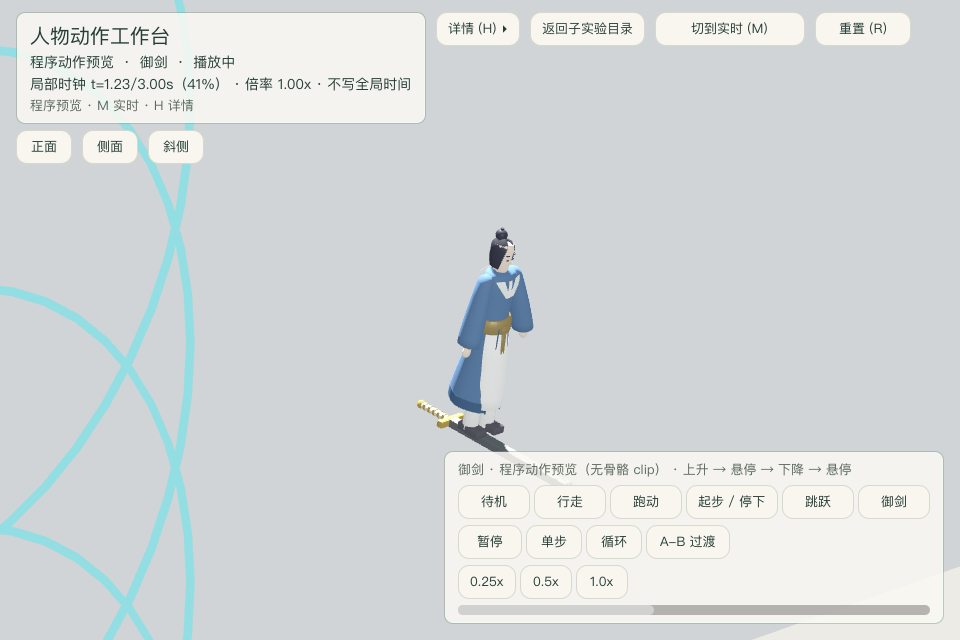
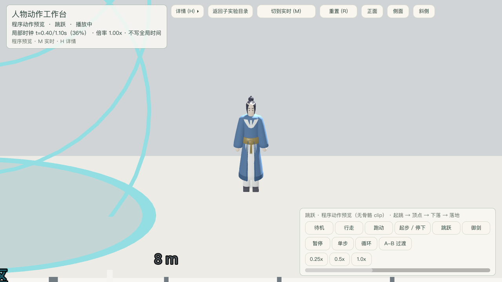
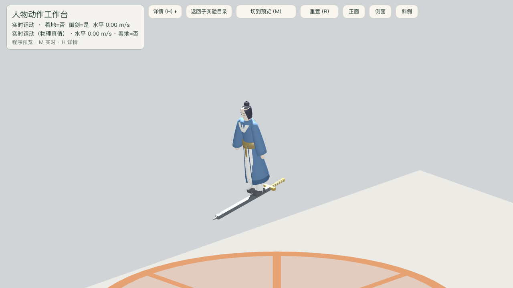
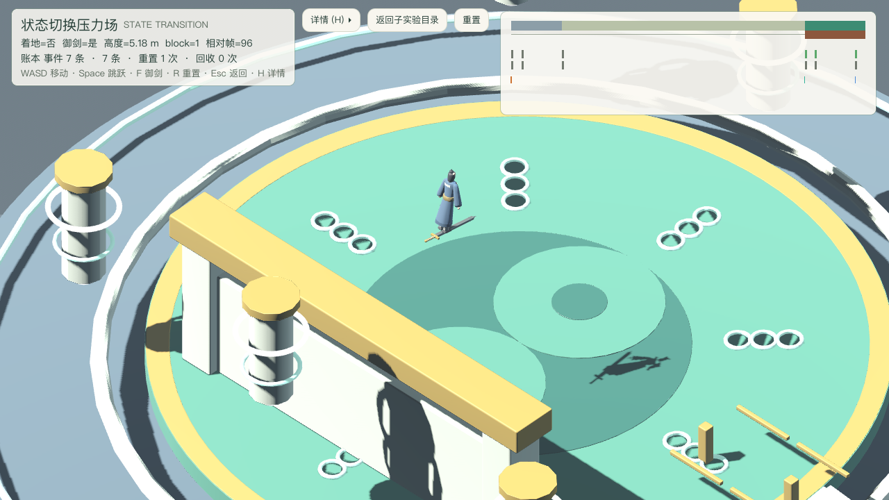

# 人物动作工作台 · 程序动作预览 P0 专项报告（2026-09-18）

场景：`res://levels/experiments/character_movement/motion_stage.tscn`（子实验「人物动作工作台」）。
决策依据：[character-movement-composable-labs](../../notes/implemented/gameplay/2026-09-18-character-movement-composable-labs.md)（S2 动作工作台）、
[composable-lab-assembly-contract](../../notes/implemented/tech/2026-09-18-composable-lab-assembly-contract.md)。
契约：[traversal-contract](../experiments/traversal-contract.md)。
本报告只记录本轮 P0（程序动作预览）的真实实现范围、限制与运行证据；骨骼 clip 库（P1/P2）不在本轮。

## 本轮交付（真实可用，不是空壳）

| 能力 | 实现位置 | 说明 |
|---|---|---|
| 动作预览展示实例 | `src/game/systems/motion_preview/motion_preview_display.gd` | 实例化共享 Visual 装配（同一 `cultivator.glb` + 同一 `cultivator_presentation.gd`），**不是** CharacterBody3D、无碰撞、无 CapabilityManager、无第二个 `move_and_slide` |
| 动作注册表与相位剖面 | `motion_preview_action.gd` | 6 条动作；`sample(phase)` 按相位给出速度 / 竖速 / 着地 / 御剑 / 飞剑 |
| 局部预览时钟 + 状态机 | `motion_preview_state.gd` | 真实帧 delta × 倍率；暂停 / 单步 / 循环 / A-B 过渡 |
| 剖面物理参数注入 | `motion_preview_params.gd` | 由工作台从 `SwordsmanMotionComponent` 注入 jump_speed / gravity / lift / sink / move_speed |
| 播放控件面板 | `motion_preview_panel.gd` | 动作选择 / 播放暂停 / 单步 / 循环 / 0.25× / 0.5× / 1× / A-B 过渡 / 进度条 |
| 共享角色视觉装配 | `src/game/actors/swordsman/cultivator_visual.tscn` | 正式角色与预览实例同源；`swordsman.tscn` 由 actor 代理接入 |
| 表现层双驱动 | `cultivator_presentation.gd` | `sample_state()` 只读采样 + `advance_state()` 共享推进 + `reset_pose()`；actor 路径与预览路径共用同一套姿态 |

### 动作集（程序近似，无骨骼 clip）

| 动作 | 剖面 | 可观察行为 |
|---|---|---|
| 待机 | 常量 | 速度 0、着地 |
| 行走 / 跑动 | 常量 | 0.5× / 1.0× move_speed，步频 = 速度 / stride_meters |
| 起步 / 停下 | 分段线性 | 速度 0 → 巡航 → 0（前 30% 起步、后 30% 停下） |
| 跳跃 | 抛物线 | v = jump_speed − gravity·t；起跳 → 顶点 → 下落 → 落地着地，预览离地峰值实测 0.95 m（理论 1.00 m，60 fps 采样） |
| 御剑 | 分段常量 | 升 +lift → 悬停 0 → 降 −sink → 悬停 0；全程御剑、飞剑可见 |

## 边界与限制（必须如实阅读）

- **无骨骼、无 IK、无动画 clip**：`cultivator.glb` 实测 0 skin / 0 animation，动作全部是**程序近似**
  （分件刚体摆动 + 按相位变化的运动剖面）。界面与读数一律标注「程序动作预览（无骨骼 clip）」，
  不冒充关键帧动画。
- **脚掌无 IK 锁定**，竖直起伏仅厘米级；**真足滑指标未建立**——它需要脚部 socket
  的世界位置与接触速度，当前无 socket，因此报告与 HUD 一律标「待建立」。
  现有的「步幅匹配」（速度 / `stride_meters`）**不是**足滑度量，两者不互相替代。
- **预览竖直位移是纯展示**：展示实例按剖面竖速积分自己的 `position.y`（起跳 / 升降因此肉眼可读），
  不写任何 actor 的 velocity / 意图 / Component，也不参与物理。
- **预览不写全局时钟**：局部预览时钟自持；`Engine.time_scale` 的唯一写入者仍是
  `src/core/time_keeper.gd`。暂停时连表现层姿态都不推进（`consumed_delta = 0`）。
- **窄屏面板遮盖（实测，未达标）**：预览模式下 UI 实际遮盖比例为
  **960×640 = 24.9%**、1280×720 = 16.6%、1920×1080 = 7.4%（测量口径：`LabHud.occlusion_rects()`
  的常显矩形 + 可见 `PreviewPanel` 矩形，除以画布面积）。
  960×640 下预览面板位于右下（x444–944, y451–624），**面板边缘落在御剑剑尖附近**；
  人物与站位仍可读，但**本工作台在窄屏不满足 ≤15% 的通用 HUD 目标**，需在后续统一排版时处理。
  本报告不声称已达标。

## 运行证据

### 验收命令

```sh
# 专项测试（不依赖全局 runner 的套件登记）
Godot --headless --path src --script res://tests/motion_preview_playtest.gd

# 工作台批次（含预览与焦点裁决）
Godot --headless --path src --script res://tests/motion_stage_playtest.gd -- \
    --batch=assembly,idle,run,turn,jump,flight,landing,removal,hud,preview,focus,surface

# 三分辨率截图（真实离屏像素，画布尺寸即输出像素尺寸）
Godot --path src --script res://tests/motion_stage_playtest.gd -- \
    --capture-prefix=<abs> --shot=preview --canvas=960x640
```

### 计数（本轮实测）

| 套件 | 结果 |
|---|---|
| `motion_preview_playtest.gd` | **99 通过 / 0 失败** |
| `motion_stage_playtest.gd`（12 批次） | **0 失败**（352 项通过） |
| 运行时单元套件（全局 runner） | **395 通过 / 0 失败** |
| Tier 0 门禁 + 负向控制 | **全部通过（27/27）** |

### 截图（本轮新图，**不覆盖**上一轮 15 张 `motion-preview-*.png`）

全部为真实离屏渲染，输出像素尺寸与画布一致（由 `SHOT ... 实际像素` 行读回）：

| 分辨率 | 文件 | 实际像素 |
|---|---|---|
| 960×640 | `motion-preview-v2-960x640-preview-{walk,jump,flight,paused}.png`、`-realtime-run.png` | 960×640 |
| 1280×720 | `motion-preview-v2-1280x720-preview-{walk,jump,flight,paused}.png`、`-realtime-run.png` | 1280×720 |
| 1920×1080 | `motion-preview-v2-1920x1080-preview-{walk,jump,flight,paused}.png`、`-realtime-run.png` | 1920×1080 |





### 剑可见的机械判据（不只断言 visible=true）

飞剑网格长轴沿角色局部 **Z**（Tip z = −1.0 → Pommel z = +0.645），
因此**侧面机位（相机在 ±Z）正对剑身端面**，只能看到几个像素——这正是上一版 1280 截图
「脚下没有剑」的原因（不是未绑定）。本轮把御剑证据改为**斜侧机位**（`VIEW_OFFSETS[2]`，与剑身约 45°），
并新增「同一构图下显示剑 / 隐藏剑两帧逐像素对比」断言，证明剑真的被渲染出来：

| 分辨率 | 显示/隐藏两帧差异像素（本轮实测） |
|---|---|
| 960×640 | 1302 / 1314（两次重跑） |
| 1280×720 | 6264 |
| 1920×1080 | 3051 |

（逐像素比较 RGB，任一分量差 > 24/255 记一次；只统计整幅画面。
该读数由 `--shot=preview` 路径内的断言打印，可随上表命令复算；
其绝对大小随动作相位与构图变化，只用于证明「剑确实被绘制」，不作为可见性阈值。）

**「侧面看不到剑」的真实原因（含一处此前的口径错误）**：飞剑网格长轴沿角色局部 Z
（`Tip` z = −1.0 → `Pommel` z = +0.645，由 GLB 节点 `translation` 与 mesh POSITION accessor
的 min/max 实测），相机若正对剑身端面就只能拍到几个像素。

但**端面朝向本身不是机位标签的问题**，本轮前半段的表述有误并在此更正：真正的缺陷是
**预览展示实例的初始朝向与角色不一致**——`VIEW_OFFSETS` 的正面 = `(14, 4.6, 0)`、侧面 = `(0, 4.6, −14)`
是按角色 `SPAWN_AIM = +X` 定义的，而预览实例当时停在默认朝向（模型正面朝 −Z），
于是**同一个「侧面」按钮在预览模式下实际拍到了预览的正面（剑的端面）**，标签与画面对不上。
这不是「侧面看不到剑」，而是**视角语义错位**。

修法（最小且不扩大 scope）：预览展示实例新增可注入的 `initial_aim`，工作台在 `add_child` 之前
注入角色的 `SPAWN_AIM`；共享预览包**不硬编码任何场景方向**（默认仍是 `Vector3.FORWARD`，
独立单测语义不变）。`heading_for_aim()` 与 actor 的 `_face_aim()` 用同一条公式
（模型局部 −Z 为正面），`reset_preview()` 与循环回卷都回到该初始朝向而不是固定 0。

机械判据（`--batch=preview` 内断言，可复算）：

| 断言 | 实测 |
|---|---|
| 预览正面与角色 `SPAWN_AIM(+X)` 一致 | forward = (1.00, 0.00, −0.00) |
| 预览朝向与实时角色朝向一致 | dot = 1.000 |
| 正面机位在预览正前方（偏移 · forward） | dot = 0.950 |
| 侧面机位在预览侧面（\|偏移 · forward\|） | \|dot\| = 0.000（确为侧面，不是正面/背面） |
| 侧面机位与预览侧向轴一致 | dot = 0.950 |
| `reset_preview()` 朝向不漂移 | heading 保持 −1.5708 |

### v3 截图（本次纠正后重拍，仅 2 张；v1 / v2 全部保留）

- `motion-preview-v3-960x640-preview-jump.png`：**侧面**机位，跳跃腾空，人物呈侧影（标签与画面对应）。
- `motion-preview-v3-960x640-preview-flight.png`：**斜侧**机位御剑，足下飞剑清晰可见（显示/隐藏两帧差异像素 6416）。

## 参数同步修正：跳跃时长由注入参数决定（本轮最后修复）

**缺陷（修复前实测）**：`MotionPreviewAction.jump` 的登记时长固定 1.1 s，而 `_jump_state` 用
`t = phase × duration`。注入 `jump_speed = 9 / gravity = 12` 时理论飞行
`2j/g = 1.5 s`，动作却在 1.1 s 结束——末尾竖速仍是 **−4.2 m/s**、`grounded = false`，
预览停在半空，而面板摘要仍写着「落地」。`jump_flight_seconds()` 当时只被测试使用，
没有参与时间轴，这就是漏洞所在。

**修法（不靠改倍率假装匹配）**：新增 `MotionPreviewAction.effective_duration(params)`：

```
effective_duration = max(登记时长, 2·jump_speed/gravity + JUMP_LANDING_HOLD)   # 仅 jump 剖面
```

`JUMP_LANDING_HOLD = 0.4333 s` 是落地后的可读停留；默认参数下
`2·6/18 + 0.4333 = 1.10 s`，**恰好等于登记时长，默认体验逐位不变**。
`MotionPreviewState.action_duration()` 让 UI 进度、局部时钟、`phase()`、`progress()` 与
`sample()` 的 `t` 全部走这一条时间轴，因此「相位 1.0」永远等于「落地并停留结束」。

**修复后实测**：

| 项 | 值 |
|---|---|
| 登记时长 / 理论飞行 / 有效时长（9 & 12） | 1.1000 / 1.5000 / **1.9333 s** |
| 相位 1.0 竖速 | **0.00**（修复前 −4.20） |
| 相位 1.0 着地 | **true**（修复前 false） |
| 默认参数有效时长 | 1.1000 = 登记时长，**未回归** |

新增断言（不只验 helper 数学）：自定义 9/12 参数**完整非循环播放到自动停止**后，
`grounded = true`、竖速 = 0、`offset_y = 0`；播放过程中出现过上升段与下落段；
实际播放时长覆盖 1.5 s 飞行段且与 `action_duration()` 一致；默认参数下有效时长与
登记时长相等且播放仍以落地结束。

## 正式角色御剑验证，与预览分离

本节的两张图是**正式 actor**（`Swordsman` + `ActorAssembly`/`FlightBundle`）的御剑证据，
用于取代"用预览展示实例图当正式角色飞剑证据"的错误引用——`MotionPreviewDisplay` **不装配 FlightBundle**，
它的剑是预览包自己从共享 `flying_sword.glb` 挂的展示节点，与正式角色的绑定链路不同实例，
不能互相充当证据。





两张图均为**真实按键驱动**（F 开御剑 → 按住 Space 上升到悬停高度 → 松键），非传送摆拍，
且都只经各场景 `rig` 的公开缩放接口收紧构图，不改场景布局、不写角色状态。

机器断言（每次取证运行时打印，两个场景同套判据）：

| 断言 | motion_stage | state_transition_lab |
|---|---|---|
| `motion.flight_active == true`（真实状态） | PASS | PASS |
| `actor.flight_visual_node()` 非空 | PASS | PASS |
| 绑定节点名为 `FlyingSword` 且在 `Visual/` 下 | PASS | PASS |
| 剑 `visible` 为真 | PASS | PASS |
| 剑含真实 `MeshInstance3D` / 三角面 | 10 个 / 486 面 | 10 个 / 486 面 |
| 悬停高度 | 约 5 m 量级 | **5.18 m**，竖直速度 0.000 m/s |
| H 详情收起 | 界面默认收起 | PASS（读回 `details_visible() == false`） |

可复算命令（临时取证脚本在 `/tmp`，不入仓；两脚本内均为公开 API + 真实输入事件）：

```sh
# 图 1：motion_stage 正式角色御剑（真实 F + Space → 斜侧机位 → rig.set_zoom_size）
Godot --path src --script /tmp/capture_real_actor_flight.gd -- \
    --out=<abs-prefix> --canvas=1280x720

# 图 2：state_transition_lab 正式角色御剑（真实 F + Space → 约 5 m 悬停 → rig.set_zoom_size）
Godot --path src --script /tmp/capture_state_real_actor_flight.gd -- \
    --out=<abs-prefix> --canvas=1280x720
```

输入步骤（两场景一致）：切到可观察机位 → `F`（key-down 边沿）开御剑 → 按住 `Space` 上升到目标高度 →
松键悬停 → 截图。脚本会先断言按住键确实被场景输入路由收到（`vertical_input > 0.9`）再驱动物理，
避免"键没被跟踪却静默不上升"造成的假失败。

**state_transition_lab 的构图限制（如实记录）**：该场景 `CameraRigConfig.size_min = 12.0` 是
场景作者为阵盘全局视野设的下限，本工作台**不修改他人包/场景**，因此该图只能取到
"人物 + 脚下剑可辨"的尺度（剑长约 30–40 px），不是特写。上表数值以场景自身读数为准；
本节的图片路径由集成者在其汇总表中引用。

## 已知未完成 / 待后续

1. **骨骼 clip 库（P1/P2）**：Blender 在庭院同形象上重建 Armature 与蒙皮，另存新目录与新
   `.blend` / `.glb` / `Action`，保留旧源与导出；AnimationLibrary / Tree 是表现资源，不一 clip 一 Capability。
2. **转身 90° / 180°、跳跃顶点、剑上四态（mount / hover / accelerate-turn-brake / dismount）**：
   本轮不扩展，等骨骼资产就绪后再做。
3. **脚部 socket 与真足滑度量**：socket 契约建立后才能测「支撑期脚的世界位置漂移」。
4. **窄屏 HUD 排版**：960×640 下 24.9% 遮盖需整合方的统一紧凑 HUD 方案收口。

## 与其它并行任务的边界

- 未改 `swordsman.tscn` / `swordsman.gd`（actor 代理所有）；本场景只**只读** `actor.flight_visual_node()`，
  角色缺剑时启动即断言装配缺陷，不在场景侧兜底新建视觉。
- 未改 `game/systems/camera_rig/`（camera 作者所有）：本场景只实例化 `camera_rig_sheet.tscn`、
  配置 `CameraRigConfig`（含 `enable_yaw_keys=false` 保留三个机位）、绑定目标与只读 `right_axis()/forward_axis()`。
- 未改全局 `test_runner.gd`、全局 notes、其它 scene 与 `lab_theme.tres`。

登记人：动作工作台代理；日期 2026-09-18。
