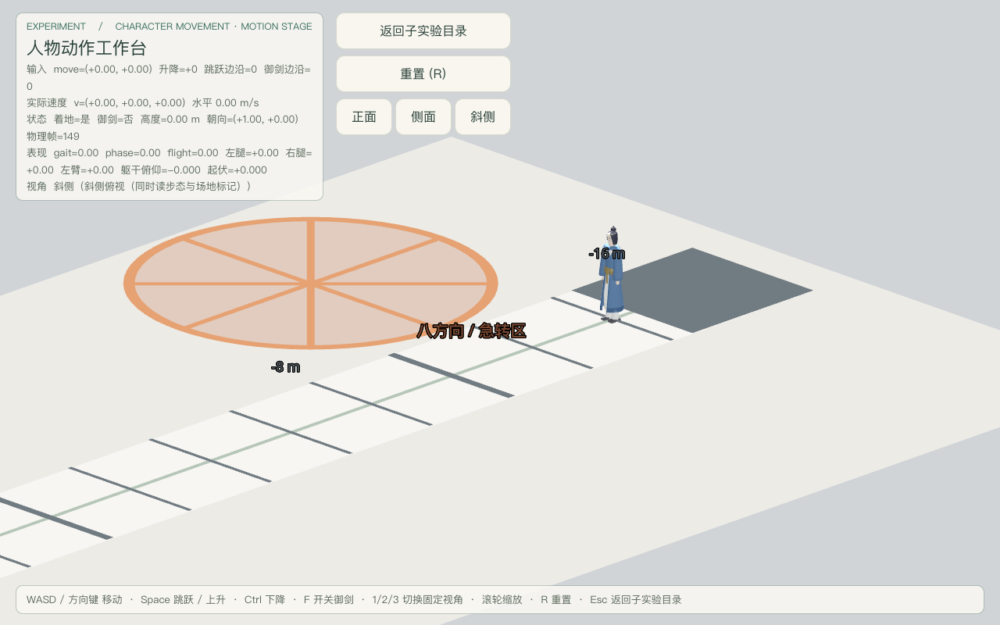
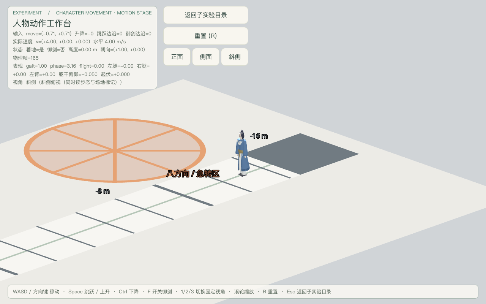
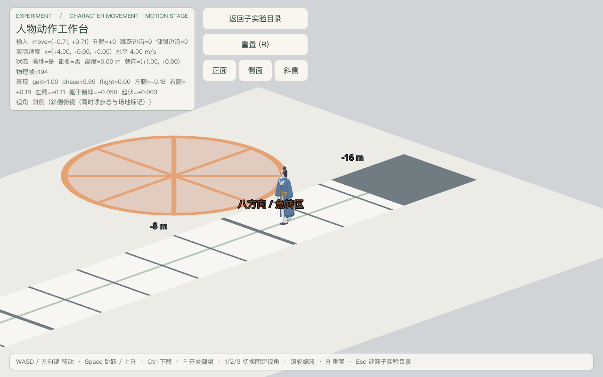
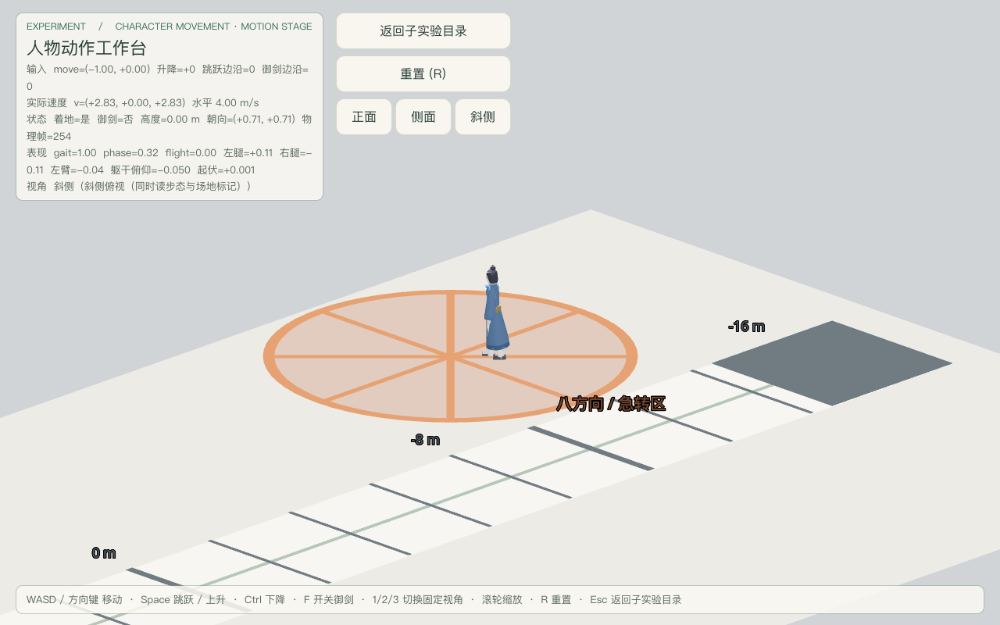

# 人物动作工作台·地面量具与斜侧移动验收（2026-09-18，surface 批次）

场景：`res://levels/experiments/character_movement/motion_stage.tscn`（子实验「人物动作工作台」，返回目标固定为同目录 `movement_lab_hub.tscn`）。
决策依据：[共面与透明穿叠导致的地面闪烁](../../notes/implemented/art/2026-09-18-coplanar-surface-shimmer.md)「第五场」；移动契约 [character-movement-subexperiments](../../notes/implemented/gameplay/2026-09-18-character-movement-subexperiments.md)。
验收档：**CLI 档**（`Godot --headless` 断言；窗口模式截图）。本轮未经 godot-ai 编辑器桥写入或运行，不冒充 MCP 档证据。
验收基线：仓库提交 `fdabf84`（`Fix coplanar surfaces in movement experiments`）+ 同一轮的未提交工作区改动。本报告与同轮对 `motion_stage.gd`（可见标记分层 / 几何 / 材质）及既有 note 的更新属于**同一轮待集成提交**：本报告如实记录该运行时实现，不单独提交，也不要求它先于 runtime 改动落库。

> **最终计数口径（集成后实测）**：工作台完整批次 **304 PASS / 0 FAIL**，surface 批次 **142 PASS / 0 FAIL**，运行时单元套件 **395 通过 / 0 失败**。
> 集成权威报告 `docs/playtest/2026-09-18-character-movement-subexperiments.md` 的人物动作工作台行与本文件一致为 **304**，九项合计 **1218**。
> 296 / 1210 是急转断言（D/A 两段速度与位移反号）加强前的初测口径，已被取代。

## 本轮主题：surface 批次首轮方向错误已修正

### 首轮事实（`/tmp/motion_stage_playtest_headless.log`）

surface 批次共两处失败，其余几何 / 材质 / 碰撞 / 相机 / 急转全部 PASS：

```
FAIL 长跑道连续跑动产生真实位移（-7.07 m）
FAIL 角色沿长跑道跑过中点（x=-13.07）
MOTION_STAGE_PLAYTEST 完成：失败 2
EXIT=1
```

### 根因

首轮把横穿长跑道的按键**写死**为 `A+S`，并同时断言「位移读数 > 20 m」与「终点 x > 8」，即默认该组合必然沿世界 +X。实测位移读数为 **−7.07 m**、终点 **x=−13.07**：**错的是输入/落点侧，不是阈值**——写死的组合、起点与角色朝向没有共同保证真实 +X 横穿，于是两条 +X 断言必然失败。

### 修法（`src/tests/motion_stage_playtest.gd`，阈值一律不放宽）

1. 新增 `_run_keys_towards(Vector3.RIGHT)`：读**实时 camera basis**（`_camera.global_transform.basis`，按场景同一公式 `right * x - forward * y`）在候选键组里选出**合成方向最接近世界 +X** 的一组键，不写死任何按键。camera 基一旦变化（切视角或改 `VIEW_OFFSETS`），选键自动跟随。**最佳组合与目标方向的点积必须 > 0.5**（`MIN_RUN_DIRECTION_DOT`）；不达标即返回空数组，调用方显式 FAIL 并中止该方向上的后续断言，不再「默认某个组合就是 +X」。
2. 起点固定在长跑道西端 `x=−15`，并把读回起点写进断言消息，避免「落点不对却看不出来」。
3. 新增断言「跑动位移沿真实世界 +X」：`Δ=(x,0,z)` 归一化后与 `Vector3.RIGHT` 的点积 `> 0.9`，位移长度 `> 0.05`。这条把方向从「默认」升级为「被断言」。
4. 窗口截图路径（`--shot=surface`）改用同一个 `_run_keys_towards`，使截图与批次不会再各按一套方向跑。

### 关于「斜侧机位下改按 D+S」的定向核对

按当前斜侧机位（`VIEW_OFFSETS[2]=(10.5, 5.6, −10.5)`）实测 camera basis：`right=(−0.7071, 0, −0.7071)`、`forward=(−0.7071, 0, +0.7071)`。代入映射公式：

| 按住 | 合成世界方向 | 是否 +X |
|---|---|---|
| A+S | `(+1, 0, 0)` | **是** |
| D+S | `(0, 0, −1)` | **否**（x 分量为 0） |

独立探针实测（90 物理帧、起点 x=−15）：按住 D+S 的位移 `Δ=(0.00, 0.00, −6.00)`，**x 方向完全不动**，只沿 −Z 跑。

因此本机位下 D+S 无法满足「沿真实 +X 从西端跑过东段」这一硬要求；若写死 D+S，两条 +X 断言会以另一种方式继续失败。修正采用任务授权的「可依据实际 camera-basis 输入选择键」：**选键交给实时基向量**，本机位下它选中 `[A, S]`（断言消息读回 `实际 [65, 83]`）。该 helper 的候选表包含 `[D, S]`，一旦基向量变为 D+S 指向 +X，它会自动选中 D+S——这正是把写死组合换成推导的收益。

## 命令与结果

| 证据 | 命令 | 结果 |
|---|---|---|
| surface 批次（本轮验收对象） | `Godot --headless --path src --script res://tests/motion_stage_playtest.gd -- --batch=surface` | **142 PASS / 0 FAIL**（首轮为 2 FAIL） |
| 工作台全批次回归 | 同上，不带 `--batch` | **304 PASS / 0 FAIL**（含加强后的急转断言；加强前为 296） |
| 运行时单元套件（11 套件） | `Godot --headless --path src tests/test_runner.tscn` | **395 通过 / 0 失败**；其中 `test_motion_stage_geometry.gd` **135 / 0** |
| surface 截图路径（窗口模式，新增） | `Godot --path src --script res://tests/motion_stage_playtest.gd -- --capture-prefix=<abs> --shot=surface` | 6 张 PNG（rest / follow-0..3 / turn）全部保存成功；该分支此前不存在 |
| 空白检查 | `git diff --check` | 无输出（exit 0） |

Godot：`4.6.stable.official.89cea1439`（`/Applications/Godot.app/Contents/MacOS/Godot`）；macOS，工程 `gl_compatibility`。
原始日志不入仓，存 `/tmp`（`surface_fixed.log`、`motion_stage_full_after_fix.log`、`test_runner_after_fix.log`）与 `~/.cache/game-xiuxian-lab/motion-stage-shimmer/`。

## 几何证据（运行态实测，非读源码常量）

机械判据落在 `src/tests/test_motion_stage_geometry.gd`（已进 `test_runner` 的 `SUITES`），并被 playtest 的 surface 批次以 `GeometryTest.assert_stage` **复用同一份实现**——「套件通过」与「运行场景通过」是同一条判据，不存在两套阈值。以下区间由实例化后的真实节点读回（`MeshInstance3D.global_transform * mesh.get_aabb()`；物理地面取 `CollisionShape3D` 世界 AABB）：

| 节点 | 世界 Y 区间 | 网格 | 材质 |
|---|---|---|---|
| `Floor`（物理） | [−0.6000, **0.0000**] | **0 个 MeshInstance3D** | — |
| `FloorPlate` | [−0.0400, 0.0000] | BoxMesh | transparency=0，alpha=1.00 |
| `Runway/RunwayBed` | [0.0200, 0.0260] | BoxMesh | transparency=0，alpha=1.00 |
| `Runway/RunwayCenterLine` | [0.0300, 0.0340] | BoxMesh | transparency=0，alpha=1.00 |
| `Runway/Stripe00..16`（17 条） | [0.0380, 0.0440] | BoxMesh | transparency=0，alpha=1.00 |
| `TurnPad/TurnPadDisc` | [0.0200, 0.0260] | CylinderMesh | transparency=0，alpha=1.00 |
| `TurnPad/Spoke0..7` | [0.0300, 0.0350] | BoxMesh | transparency=0，alpha=1.00 |
| `TurnPad/TurnPadRing` | [0.0390, 0.0450] | **ArrayMesh**（矩形截面环带） | transparency=0，alpha=1.00 |
| `FlightPad/FlightPadDisc` | [0.0200, 0.0260] | CylinderMesh | transparency=0，alpha=1.00 |
| `FlightPad/FlightPadRing` | [0.0390, 0.0450] | **ArrayMesh**（矩形截面环带） | transparency=0，alpha=1.00 |
| `JumpRuler/RulerBase` | [0.0200, 0.0240] | BoxMesh | transparency=0，alpha=1.00 |

固定垂直相邻层对的净空（断言要求 ≥ 1.5 mm，全部满足且这些层对**无一对区间相交**；不做同层两两扫描）：`FloorPlate → Bed → CenterLine → Stripe` 依次 **20 / 4 / 4 mm**；`Disc → Spoke → Ring` 依次 **4 / 4 mm**，`Ring` 相对 `disc` **13 mm**；`FlightPad` 同样 20 / 13 mm。
对照修复前（note 记录的实测）：Bed 底 = FloorPlate 顶 = 0（共面）、Stripe 底 0.008 < CenterLine 顶 0.015（穿叠）、Ring 最低 −0.086（穿地）。`test_motion_stage_geometry.gd` 内含 7 条**负向控制**：用这些修复前实测值复算，必须被同一净空 / 不透明判据拒绝。

## 材质证据

8 个地面量具（`FloorPlate`、`RunwayBed`、`RunwayCenterLine`、`RulerBase`、`TurnPadDisc`、`TurnPadRing`、`FlightPadDisc`、`FlightPadRing`；修复前的 7 个半透明颜色对应其中 7 个）+ 8 根辐条 + 17 条刻度线，全部：**使用 `StandardMaterial3D` 覆盖材质**且**不透明**（`transparency=0`、alpha=1.000）。半透明曾是闪烁机制之一（alpha 排序抖动）；改为等效不透明后该机制在结构上不再可能。像素读数：`Runway/Stripe00..16` 逐条 PASS。

## 碰撞 / 地面证据

| 观测点 | 阈值 | 实测 |
|---|---|---|
| 物理地面 `Floor` 碰撞盒顶面 | 严格 y=0 | **0.000000** |
| 运行中向下射线命中点（`collision_mask=1`） | 严格 y=0 | **−0.000000** |
| `Floor` 子树 MeshInstance3D | 0 个 | **0**（物理地面不可见，不存在可见面竞争） |
| 角色出生 / 跑动结束贴地 | y < 0.2 | **y=0.000** |

即：可见量具只是抬高的标记层，**可走面仍由不可见物理地面提供且顶面严格 y=0**，角色高度未被修复改动。

## 斜侧移动跟随与急转操作

surface 批次（headless，真实按键事件经 `Input.parse_input_event`，非直接改状态）：

1. `KEY_3` 切斜侧视角，读回 `view_index()==2`；
2. 读实时 camera basis，选取合成世界 +X 的键组（本机位实测 `[A, S]`）；
3. 传送到西端 `x=−15`，等 12 帧稳定着地，记录起点与相机位置；
4. 按住该键组跑动，每 **14 个物理帧**采样一次相机偏移与 `on_floor`，`x>10` 提前结束（上限 32 次采样）；
5. 松键后等 45 帧让相机收敛，再断言；
6. 急转盘硬反转：传送到八方向区圆心 `(−11.5, 0.05, 5.0)` 并等 30 帧稳定；记录 `D` 段位移与段末实际速度，立即切 `A` 16 帧，再记录 `A` 段位移与段末速度——断言两段速度反号、两段位移反号、角色仍在盘内，而非只看对称回零。

| 观测点 | 允许阈值（未放宽） | 实测 |
|---|---|---|
| 位移方向 | 与 +X 点积 > 0.9 | **Δ=(25.20, 0.00, 0.00)** |
| 长跑道连续位移 | ≥ 20 m 且终点 x > 8 | 横穿 **25.20 m**（−15.00 → **10.20**） |
| 跟随相机位移 | > 15 m | **22.65 m**（27 次采样） |
| 运动中机位偏移误差 | < 2.5 m（相对斜侧偏移 (10.5, 5.6, −10.5)） | 峰值 **0.667 m**（跟随滞后） |
| 停下后机位回到斜侧偏移 | < 0.6 m | 误差 **0.006 m** |
| 跑动全程贴地 | 每次采样都 `on_floor` | **27 / 27**，结束 y=0.000 |
| 急转盘硬反转后离心距 | ≤ 3.0 m（盘半径 3.2） | **0.00 m** |
| 硬反转后状态 | 仍着地 | `on_floor=true` |
| 全程视角 | `view_index()==2` | **2** |

急转批次（headless）新增的真实位移 / 速度断言实测：`D` 段 1.20 m、段末速度 4.00 m/s；`A` 段 0.80 m、段末速度 4.00 m/s；两段速度点积 **−16.00**、位移点积 **−0.96**；急转后离盘心 **0.40 m**、仍着地。方向反转不再只由「转身增益对称回零」推断。

对照首轮：方向断言由「默认 A+S 就是 +X」改为「按 basis 选键 **且** 实测方向点积 > 0.9」；位移阈值仍为 ≥ 20 m、终点仍为 x > 8、相机与贴地阈值一字未动。

## 实际画面

窗口截图路径用同一键组推导（真实按键驱动，非摆拍）：









6 张 PNG（rest / follow-0..3 / turn）在 `docs/playtest/`，是**本轮新增的探索资产**：surface 截图路径（`--shot=surface` 分支）此前不存在，默认完整截图也不产出它们（本轮已改为只在显式请求时运行）。按根 AGENTS.md「所有项目资产必须进入 Git」，这 6 张 PNG 随同轮待集成提交一并入库，不留在未跟踪状态。它们与本轮代码运行时同一相机基向量，且原截图路径写死的 `A+S` 在该基下**本来就是** +X 组合，因此这 6 张不需要重拍；截图路径改为走同一 `_run_keys_towards`，防止后续基向量变化时截图与批次方向不一致。
读图结论限于「层与层分离清楚、边缘锐利、无修复前那种面竞争轮廓」；**不**据此宣称运动中不闪（见下）。

## 限制（必须连同上面结论一起读）

- **本轮无可靠的动态像素证据。** 窗口模式连续两帧地面区域（`Rect2i(320,300,640,240)`）字节差异在不同尝试中为：静止 **14.271%** / 移动 **7.031%**；静止 **13.786%** / 移动 **7.974%**；静止 **16.846%** / 移动 **10.667%**；以及一次两帧渲染超时、读数双双为 **0.000%** 的失败尝试。**静止组读数高于移动组且离散度极大**，说明该口径主要测到 macOS 窗口合成/呈现时序，而不是地面闪烁；它既不能证明「闪」也不能证明「不闪」。
- **无头模式没有像素读数**：headless 不产生绘制帧，surface 批次只打印几何/材质/碰撞/位移断言，不打印 `PIXEL` 行。窗口截图路径会打印「静止组 / 移动组」两帧地面区域字节差异，但该读数**只记录、不判 PASS/FAIL**，且无判别力（见上）；本报告不声称存在「headless 静止零差断言」。
- 修复前基线画面未采集：共享工作区里 runtime 改动属于同一轮、且不得回滚他人已落地实现，无法在不回退工作区的前提下取得 before 像素。**结论：「移动中是否仍在闪」未经像素级验证，需人工试玩确认**；本轮能证明的是几何与材质层面（垂直相邻层零共面 + 垂直相邻层零穿叠 + 全不透明）三个致闪机制在结构上已被排除。
- 截图基础设施本轮**新增** surface 分支（`--shot=surface`，此前不存在）：产出 6 张 PNG 作为新探索资产入 `docs/playtest/` 并随同轮提交入库；未新增探针脚本（临时方向探针写在 `/tmp`，不入仓），未改动既有 7 张截图。
- 本场是运行时程序几何（无 GLB）：修复只在 `motion_stage.gd` 内改高度分层、几何与材质，**未改动任何既有探索资产**（本轮新增的 6 张 surface 截图除外，见上）。
- 层间净空断言只覆盖命名的**垂直相邻层对**（`FloorPlate → Bed → CenterLine → Stripe*`、`FloorPlate → *PadDisc → Spoke* → *PadRing`、`FloorPlate → RulerBase`），不做同层两两体积相交扫描；`TurnPad` / `FlightPad` 的 8 根 `Spoke*` 同层同色、在盘心互相重叠，重叠处输出同一颜色、不构成可见材质竞争，**未纳入层间断言**。本报告所称「零穿叠」仅指上述垂直相邻层之间。
- 跑道尽头端线是 3 m × 3 m 深色方块（`Stripe00 / Stripe16`，宽度本就等于跑道全宽），不透明化后比修复前更实、更显眼；这是既有设计尺寸，本轮只改颜色与厚度，未改尺寸。
- 手感与审美仍需使用者试玩；结构断言不承诺「看起来舒服」。
