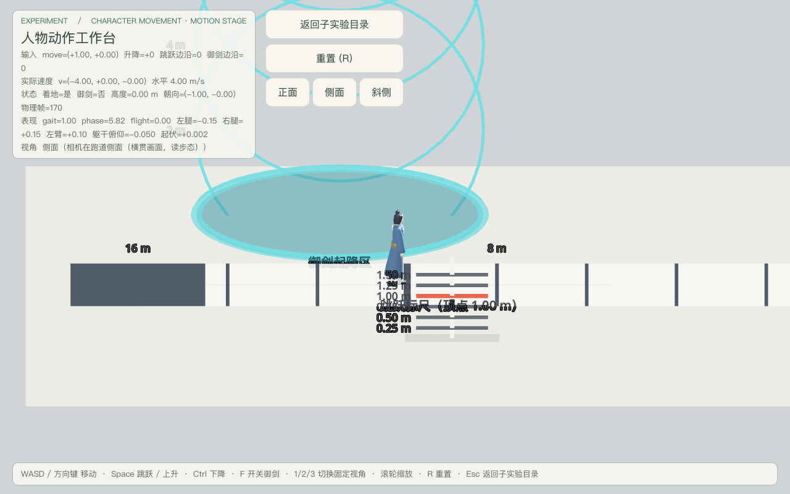
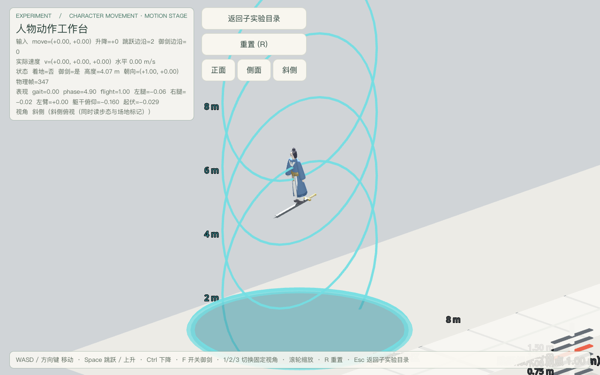
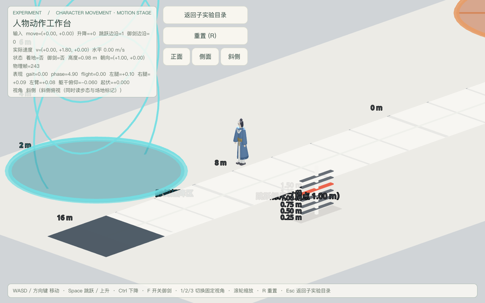
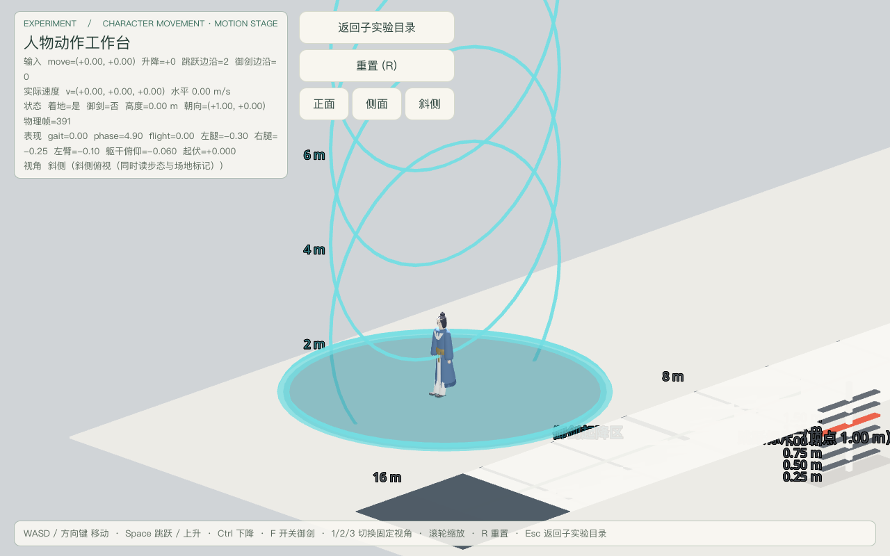
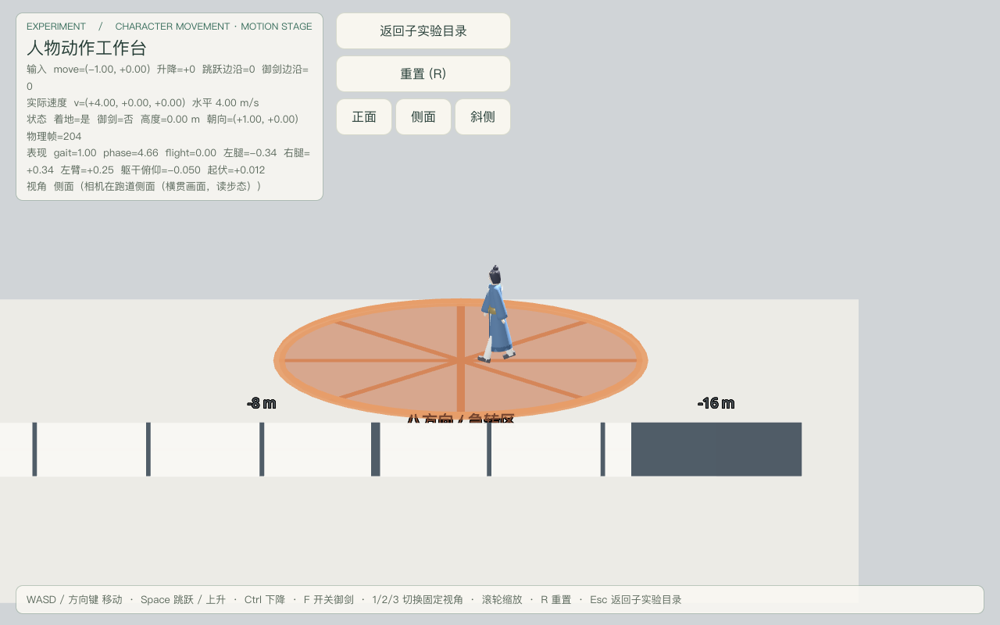
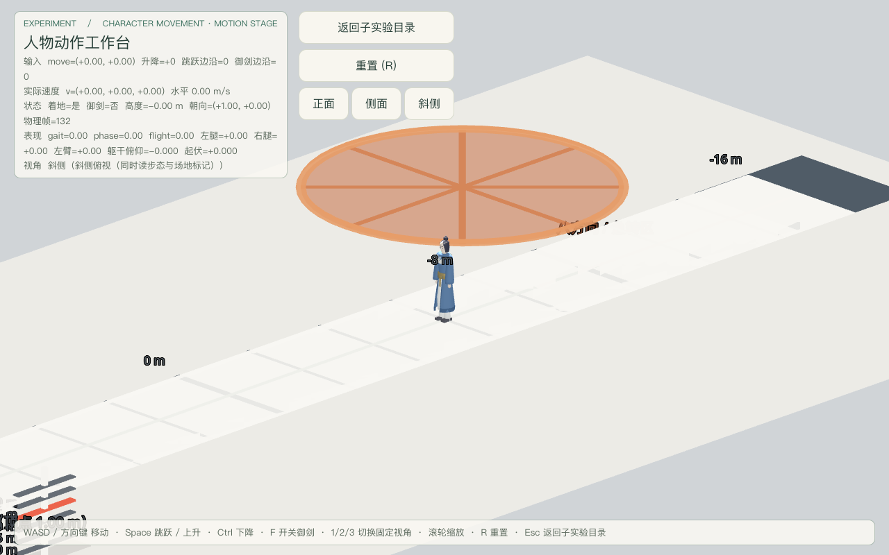
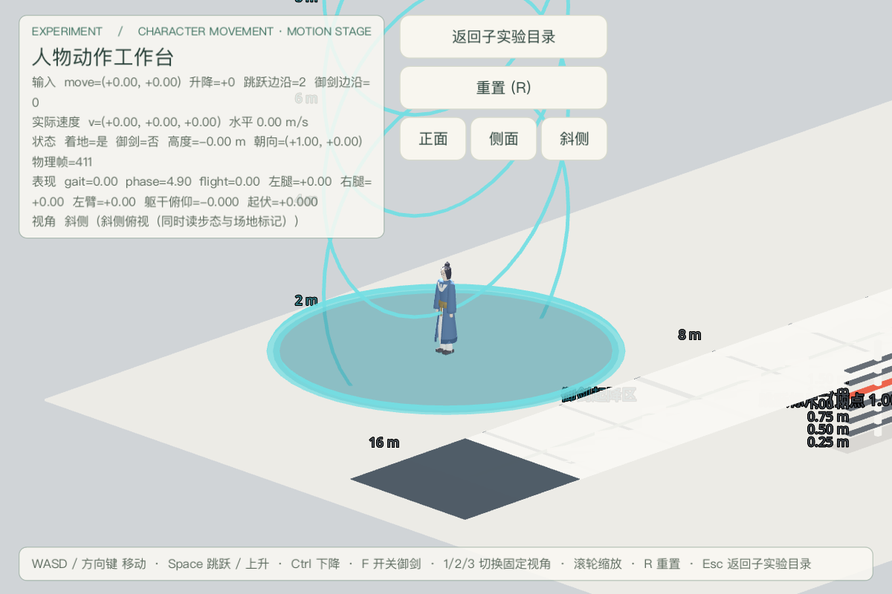

# 人物动作工作台验收（2026-09-18）

场景：`res://levels/experiments/character_movement/motion_stage.tscn`（本子实验入口，返回目标固定为同目录 `movement_lab_hub.tscn`）。
决策依据：[character-movement-subexperiments](../../notes/implemented/gameplay/2026-09-18-character-movement-subexperiments.md)（子实验「人物动作工作台」）。
契约：[traversal-contract](../../docs/experiments/traversal-contract.md)。门禁档：**CLI 档**（`godot --headless` + 窗口模式截图；编辑器桥未用于本轮，不构成依赖）。

本文件只保留结论与判定证据；原始运行日志不入仓，存 `~/.cache/game-xiuxian-lab/motion-stage/`（可再生产物，按验收记录规则留在仓外）。

## 最终摘要

- 工作台验收：**154 PASS / 0 FAIL**，stderr **0 行**（`motion-stage-final.log`，单进程完整跑）。这是本文件的最终计数。
- 以下三项为**开发时快照**，只证明本工作台开发当刻没有踩坏邻居，**不是最终交付口径**；
  跨套件最终集成口径一律不在此处复述，见
  [character-movement-subexperiments](2026-09-18-character-movement-subexperiments.md)：
  - 运行时单元套件：开发时快照 177 通过 / 0 失败。
  - Tier 0 门禁 + 负向控制：开发时快照，全部通过、27/27。
  - 既有回归：开发时快照，庭院 33/33、顶层目录 13/13。
- 截图 7 张入仓 `docs/playtest/`；跑动与御剑为真实按键驱动，非传送摆拍。
- 仍为 **3 个 Capability**；`move_and_slide` 全仓仍只有 actor 根一处。

## 五问分类

| 矩阵 ID | 1 已实现 | 2 已运行通过（命令 + 日志） | 3 静态检查 | 4 未验证 | 5 外部阻塞 |
|---|---|---|---|---|---|
| A1 场景装配（真实 Swordsman + 表现节点） |  | ✔ 角色含三能力与 `Visual/CultivatorPresentation` |  |  |  |
| A2 场地标记（直跑道 / 八方向 / 跳跃标尺 / 御剑起降区） |  | ✔ 四类标记节点齐备，刻度按米生成 |  |  |  |
| A3 跳跃标尺读数由组件参数推导 |  | ✔ 满分刻度 = jump_speed²/(2g) = 1.00 m |  |  |  |
| A4 唯一物理提交点 |  | ✔ 能力脚本 0 处调用 | ✔ actor 根 1 处；工作台 0 处 |  |  |
| A5 工作台只经公开输入 API |  |  | ✔ 8 个 API 全在；无 velocity / 意图 / 能力类名写入 |  |  |
| I1 待机 |  | ✔ v=0、gait=0、相位不推进 |  |  |  |
| I2 跑动（代表链路） |  | ✔ 4.00 m/s、Δx 真实位移沿相机右方 |  |  |  |
| I3 两个时间点读回证明动作变化 |  | ✔ 相位 Δ=1.46、左腿角 Δ=0.38 |  |  |  |
| I4 停下归零 |  | ✔ v=0、gait=0、腿角回 0.00 |  |  |  |
| I5 斜向不超速 |  | ✔ ≤ 4.00 m/s |  |  |  |
| I6 方向反转 |  | ✔ turn 峰值 0.51 → 衰减 0.00 |  |  |  |
| I7 八方向区 |  | ✔ 8 个方向全部产生位移 |  |  |  |
| J1 跳起 / 空中 |  | ✔ airborne 峰值 1.00、Δy=1.05 m |  |  |  |
| J2 落地过渡 |  | ✔ landing 峰值 0.90 → 衰减 0.00 |  |  |  |
| J3 按住不连跳 |  | ✔ 上升段 1 次 |  |  |  |
| F1 站立 → 御剑 |  | ✔ flight 增益 0.00 → 0.61 |  |  |  |
| F2 上升 / 悬停 / 下降 |  | ✔ ±7.00 m/s、vy=0、高度稳定 Δy=0.00 |  |  |  |
| F3 水平飞行 |  | ✔ 12.00 m/s |  |  |  |
| F4 关飞 → 落地 |  | ✔ 3.50 m 关飞、landing 峰值 0.93、增益归零 |  |  |  |
| F5 御剑视觉 |  | ✔ 剑随 flight_active 显隐 |  |  |  |
| D1 删除表现节点后三能力仍正确 |  | ✔ 移动 4.00 / 跳跃 1.05 m / 御剑升降开关全通过 |  |  |  |
| D2 缺表现节点时 HUD 不崩 |  | ✔ 如实标注「表现节点缺失」 |  |  |  |
| H1 HUD 显示输入 / 速度 / 状态 / 视角 |  | ✔ 四项文本实读 |  |  |  |
| H2 小窗不溢出 |  | ✔ 960×640 画布下读数面板 / 按钮 / 底部说明均在画布内 |  |  |  |
| H3 视角切换不改角色与能力 |  | ✔ 1/2/3 切换后位置与御剑状态不变 |  |  |  |
| H4 返回文案与真实目标一致 |  | ✔ 按钮「返回子实验目录」、提示「Esc 返回子实验目录」读回；源码无旧文案残留 | ✔ 返回常量与文案同指 MOVEMENT_HUB_SCENE |  |  |
| R1 R 重置与阻塞清账 |  | ✔ 回出生点、关飞、tag 计数 0 |  |  |  |
| R2 Esc 返回 |  | ✔ 进入移动子实验目录（存在时） |  |  |  |
| V1–V7 截图证据 |  | ✔ 7 张（待机 / 跑动 / 转身 / 跳跃 / 御剑 / 落地 / 小窗） |  |  |  |
| V8 手感与审美 |  |  |  | ✔ 需使用者试玩 |  |

## 命令与日志

| 证据 | 命令 | 结果 |
|---|---|---|
| 工作台验收（完整） | `Godot --headless --path src --script res://tests/motion_stage_playtest.gd` | 154 PASS / 0 FAIL，stderr 0 行 |
| 门禁 + 单测（开发时快照） | `python3 tools/verify/run_all.py --with-tests` | 门禁全过、负向控制 27/27、单测 177/177 |
| 庭院回归（开发时快照） | `Godot --headless --path src --script res://tests/character_movement_playtest.gd` | 33 PASS / 0 FAIL |
| 顶层目录回归（开发时快照） | `Godot --headless --path src --script res://tests/lab_playtest.gd` | 13 PASS / 0 FAIL |
| 截图（7 张） | `Godot --path src --script res://tests/motion_stage_playtest.gd -- --capture-prefix=<abs>` | 全部 exit 0 |
| 群山回归（开发时快照） | `Godot --headless --path src --script res://tests/mountain_traversal_playtest.gd -- --batch=assembly,move,jump,flight,tags` | 42 PASS / 0 FAIL |

上面除「工作台验收」外的行都是**本工作台开发当刻的旁路快照**，用于证明当时没有踩坏邻居，
**均非最终交付口径**，也不在此处复述任何最终数字；跨套件最终集成口径见
[character-movement-subexperiments](2026-09-18-character-movement-subexperiments.md)。

原始日志（不入仓，存 `~/.cache/game-xiuxian-lab/motion-stage/`）：`motion-stage-final.log`（工作台 154 项）、`motion-stage-capture.log`（截图运行）、`mountain-regression.log`（群山 42 项快照）。

## 实际画面

人工观察（自动检查不替代）：侧面机位下跑道刻度与角色步态同框，可读出腿臂反相；斜侧机位能同时看到跳跃标尺读数与角色顶点；御剑画面里剑在足下、高度环可作绝对高度参照；小窗下读数面板收窄到约画布四成宽，未遮住角色与场地中心。

## 已知限制

- **模型无骨骼、无 IK**：GLB 是 23 个独立分件（`Leg_L/Foot_L`、`Arm_Sleeve_L/Cuff_L/Hand_L` 等），表现层按实测包围盒在髋 / 肩 / 腰建枢轴做刚体摆动，不是骨骼动画。脚掌无 IK 锁定，落地压缩是躯干局部位移，不改变脚底物理基准。
- 跳跃顶点按组件参数为 1.00 m，实测 1.05 m（含单步过冲）；标尺刻度即该理论值，手感结论仍需使用者试玩。
- 动作过渡由物理状态边沿驱动（着地沿、速度方向、flight_active），不依赖动画帧；因此没有动画混合曲线，转换是增益衰减式而非关键帧插值。
- 工作台是观察场地，不是玩法场景：地面与边界只服务观察，无地形高低差、无战斗装配。
- 手感与审美需使用者试玩；程序建模与分件摆动不等于成品美术。
- 小窗证据用内容画布（`content_scale_size` 960×640）触发真实 Control 重排；工程用 canvas_items 拉伸，改 OS 窗口尺寸只会等比缩放、不触发重排，故未采用改窗口方式（且 macOS 窗口遮挡会节流渲染导致截帧超时）。

## 与其他并行任务的边界

- 未改动 `experiments.json`、子实验清单、`movement_lab_hub.*`、`camera_lab*`、Capability / Component 字段与现有庭院 / 群山场景。
- `cultivator_presentation.gd` 为既有文件的扩展：保留全部原有导出参数与枢轴断言，新增腾空 / 落地 / 转身 / 御剑俯仰增益与只读 `pose_state()`；`swordsman.tscn` 未改动。
- `Esc` 返回目标优先移动子实验目录，未落地时回退顶层 `lab_hub.tscn`（不硬依赖并行文件）。
  集成收口后子实验目录已落地，实际返回路径为移动子实验目录；本报告其余实测数字保持为当时快照。
