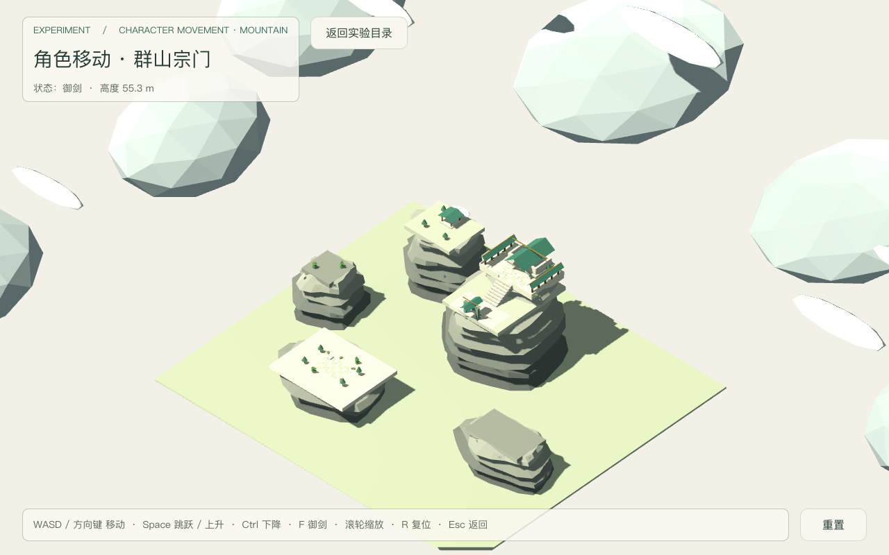
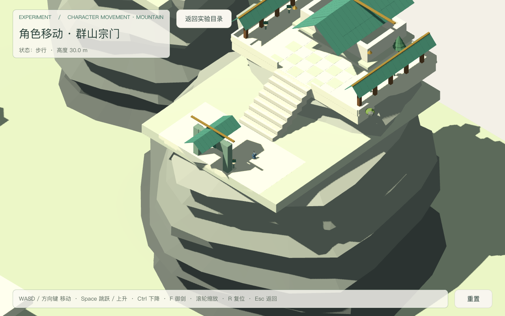
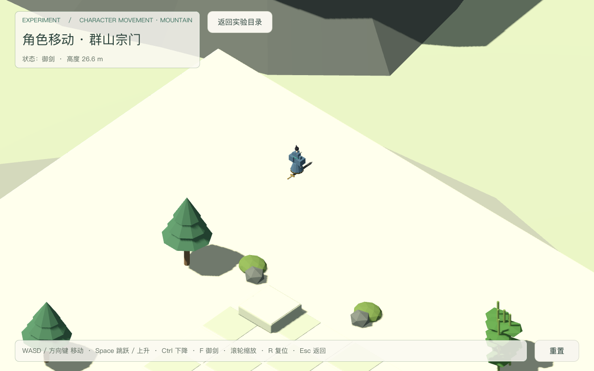
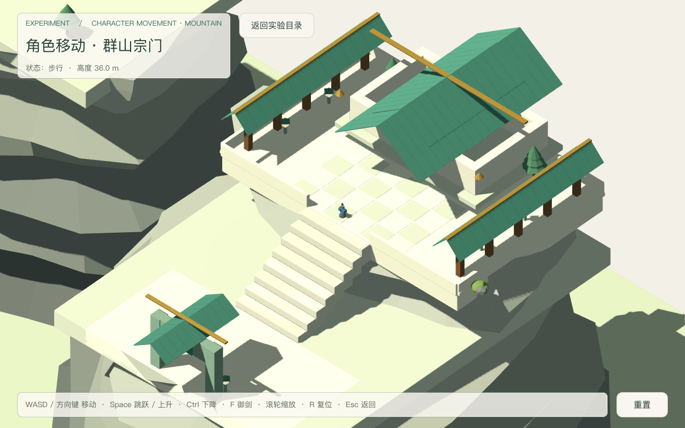
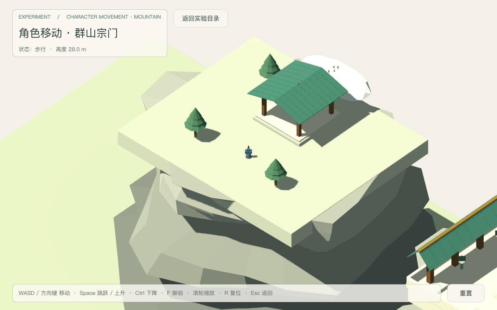
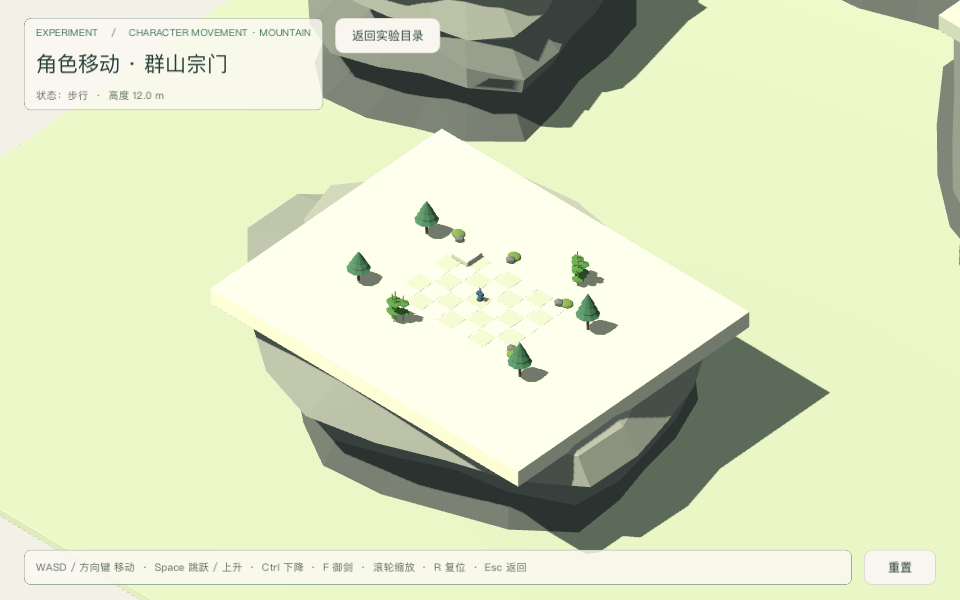

# 群山宗门移动探索验收（2026-09-18）

场景：`res://levels/experiments/character_movement/mountain_realm.tscn`（本轮入口）。
决策依据：[mountain-traversal](../../notes/implemented/gameplay/2026-09-18-mountain-traversal.md)。
验收矩阵：[traversal-acceptance-plan.md](../experiments/traversal-acceptance-plan.md)（历史前置计划，已执行）。
契约：[traversal-contract.md](../experiments/traversal-contract.md)、[layout-contract.md](../art/mountain_realm/layout-contract.md)。
执行：独立验收代理独占全部 Godot 运行；父代理只审计日志 / 源码 / 图片，不跑测试。

## 最终摘要

- 真实物理集成矩阵：**174 项 PASS / 0 FAIL**（`mt-final.log`，单进程，最终资产）；测试驱动加固后复跑 `mt-final2.log` 同样 174 / 0。stdout 无 FAIL；stderr 仅 5 行，全部是掉出回收用例主动把角色放到 `fall_out_y` 之下触发的预期 WARNING（见下）。
- 运行时单元套件：**129 通过 / 0 失败**，stderr 0 行（`tests-final.log` / `tests-final.err`）。
- Tier 0 门禁 + 负向控制：全部通过，负向控制 **27/27**（`gates-final.log`）。
- 旧庭院回归：**33 通过 / 0 失败**（`garden-final.log`）；hub 回归：**13 通过 / 0 失败**（`hub-final.log`）。
- 截图 6 张全部入仓 `docs/playtest/`；飞行相关画面由真实按键产生，捕获前打印 `SNAPSHOT` 状态行（`flight=true`、离地高度、阻塞计数）。
- 最终资产哈希：可见 GLB `d17524a6…`、碰撞 GLB `22eb30a4…`、布局 JSON `2fbbf4c8…`、御剑 GLB `3497f1c4…`（本次验收所用版本）。

## 五问分类

| 矩阵 ID | 1 已实现 | 2 已运行通过（命令 + 日志） | 3 静态检查 | 4 未验证 | 5 外部阻塞 |
|---|---|---|---|---|---|
| G1 Tier0 + 负向控制 |  | ✔ 27/27 拒绝（gates-final.log） |  |  |  |
| G2 运行时套件 |  | ✔ 129/129，stderr 0 行（tests-final） |  |  |  |
| G3 能力目录恰三项 |  | ✔ gen --check 通过 | ✔ catalog count=3 |  |  |
| G4 词汇登记与新鲜 |  | ✔ index/catalog --check 通过 | ✔ tag 与字段已登记 |  |  |
| G5 组件纯度与解耦 |  | ✔ verify 通过 | ✔ 能力互不引用 |  |  |
| G6 场景引用完整性 |  | ✔ verify-scenes 通过 | ✔ 3 个 GLB preload 均存在 |  |  |
| G7 目录与旧场景回归 |  | ✔ hub 13/13；庭院 33/33 |  |  |  |
| P1 场景装配 |  | ✔ 布局 / 75 盒 / 5 壳 / 3 落点 |  |  |  |
| P2 移动与方向键等价 |  | ✔ 真实位移 + 转向 |  |  |  |
| P3 斜向限速 |  | ✔ W+D 4.00 m/s |  |  |  |
| P4 起跳与落地 |  | ✔ 顶点 1.05 m，落回 12.00 |  |  |  |
| P5 按住不连跳 |  | ✔ 起跳次数 1 |  |  |  |
| P6 空中不重复起跳 |  | ✔ 次数 1，顶点不增 |  |  |  |
| P7 低台阶站立 |  | ✔ jump_step 12.55 稳定 |  |  |  |
| P8 飞行开关与重力 |  | ✔ 关飞加速度 -18.0 |  |  |  |
| P9 升降与悬停 |  | ✔ ±7.00 m/s，悬停 vy=0 |  |  |  |
| P10 飞行快于步行 |  | ✔ 12.00 m/s |  |  |  |
| P11 撞山 |  | ✔ 西峰 / 东岭命中本体 |  |  |  |
| P12 撞楼 |  | ✔ 主殿南墙命中本体、不穿透 |  |  |  |
| P13 两处平台降落 |  | ✔ summit 36.00 / north 28.00 |  |  |  |
| P14 边界与高度上限 |  | ✔ East 墙 / 天花 |  |  |  |
| P15 掉出回收 |  | ✔ 回 spawn 并清账 |  |  |  |
| P16 单物理提交点 |  | ✔ 运行时行为证据 | ✔ 仅 actor 一处调用 |  |  |
| E1 同帧 F+Space |  | ✔ 起飞升起 3.00，无补跳 |  |  |  |
| E2 起跳后开飞 |  | ✔ 限幅接管 |  |  |  |
| E3 空中关飞 |  | ✔ 重力恢复并落地 |  |  |  |
| E4 飞行阻塞跳跃 |  | ✔ Jump 不激活 |  |  |  |
| E5 Tag 清账 |  | ✔ 四条路径 count=0 |  |  |  |
| E6 失焦悬停 |  | ✔ flight=true，vy=0，Δy=0.00 |  |  |  |
| D1/D2/D3 拆装 |  | ✔ 装配移除后其余仍工作 |  |  |  |
| D4 静态解耦（不删包） |  |  | ✔ 无跨包类名引用 |  |  |
| R1–R6 重置 / 退出 / 回归 |  | ✔ R 全清、Esc 回 hub、静态无残留 |  |  |  |
| V1 输入飞行取证 |  | ✔ SNAPSHOT flight=true + 离地 |  |  |  |
| V2 群山全貌 |  | ✔ overview 截图 |  |  |  |
| V3 地面宗门 |  | ✔ sect-ground 截图（真实步行到开阔处） |  |  |  |
| V4 空中御剑 |  | ✔ flight-closeup 截图，足下剑可辨 |  |  |  |
| V5 两处山顶降落 |  | ✔ summit / north 两张截图 |  |  |  |
| V6 两窗口尺寸 |  | ✔ 1280×800 与 960×640（实际 960×600 视口） |  |  |  |
| V7 曝光与画面审计 |  |  | ✔ 人工查看 6 张：非高光地表与角色可辨、无大片细节丢失；云雾与高光允许纯白 |  |  |
| V8 手感 / 审美 |  |  |  | ✔ 需使用者试玩 |  |

说明：G3–G6 的「已运行通过」指对应门禁脚本实跑；「静态检查」列为同一行的附加只读证据，不替代运行。

## 命令与日志

原始日志在 `~/.cache/game-xiuxian-lab/`（不入仓）：

| 证据 | 命令 | 日志 / 结果 |
|---|---|---|
| Tier 0 + 运行时 | `python3 tools/verify/run_all.py --with-tests` | `gates-final.log`：门禁全部通过、负向控制 27/27、129/129 |
| 群山物理矩阵（最终） | `Godot --headless --path src --script res://tests/mountain_traversal_playtest.gd` | `mt-final.log`：174 PASS / 0 FAIL；`mt-final2.log` 复跑同样 174 / 0；两份 `.err` 仅掉出回收预期 WARNING |
| 庭院回归 | `Godot --headless --path src --script res://tests/character_movement_playtest.gd` | `garden-final.log`：33 PASS / 0 FAIL |
| hub 回归 | `Godot --headless --path src --script res://tests/lab_playtest.gd` | `hub-final.log`：13 PASS / 0 FAIL |
| 运行时单测（独立记录） | `Godot --headless --path src tests/test_runner.tscn` | `tests-final.log`：129 通过 / 0 失败；`tests-final.err` 0 行 |
| 截图（6 张） | `Godot --path src --script res://tests/mountain_traversal_playtest.gd -- --capture-prefix=<abs> --shot=<name>` | `final-overview.log` / `final-flight3.log` / `shotv5-sect.log` / `shotv6-landing-summit.log` / `shotv6-small.log` / `shotv7-north.log`（全部 exit 0） |

预期诊断（非运行错误）：掉出回收用例主动把角色放在 `fall_out_y=-6` 之下（y=-10），场景按设计 `push_warning` 并回 spawn；该 WARNING 是断言前置，不修改生产代码、不吞 warning。

## 实际画面

人工观察（自动检查不替代）：HUD 上下信息区有纸白半透明底，地形背景上文字可读；松树树冠与树干位置正常；御剑足下剑与御剑状态 HUD 可见；宗门截图角色位于月台开阔处，未再被门楼屋顶遮挡；小窗 HUD 完整且未遮主要区域。全貌与宗门图中的前景山体/屋顶仍可能遮住角色，属已知限制。

## 已知限制

- 相机固定俯视并随角色高度跟随；**山体 / 屋顶遮挡角色的问题尚未处理**，高空全貌与宗门庭院构图存在遮挡。
- 跳跃顶点约 1.0 m、单级台阶 0.75 m 需起跳；数值来自布局校验，不代表最终手感。
- 角色为静态网格随方向转身，没有走路或骨骼动画。
- 远山与云为装饰、无碰撞；世界边界由场景四墙 + 天花承担，越下沿回收。
- 飞行降落由测试脚本按相机基选键驱动（窗口聚焦时 macOS 可能注入真实按键），不等于人类操作手感；截图飞行路径因此使用非严格纯垂直断言，但飞行状态与落点均为真实物理结果。
- 手感与审美需使用者试玩；AI 程序建模不等于成品美术。

## 本轮发现与修复（测试侧，非生产缺陷）

1. 巡航驱动把 `move_input.y` 的 W/S 判反，导致飞离目标；已改为 W 对应屏幕上方。
2. 稳定着地用例误用 spawn 高度 12 等待山顶 36 平台；`_wait_floor` 增加 `expected_y` 参数。
3. 多个 `async` 辅助函数漏 `await`，导致假失败；已补齐。
4. 山体壳数量断言曾按 `shell_count` 求和（8）；实际每峰一个合并壳节点（5）。已改为按节点身份 + 覆盖底座/台顶断言。
5. 相机缩放断言曾把滚轮后的当前值当默认；改为读场景声明常量 `CAMERA_SIZE`。
6. 窗口聚焦时 macOS 可能向窗口注入真实按键，导致纯上升段出现水平漂移；截图路径改为非严格断言并记录实际轨迹，物理矩阵仍保持严格断言。