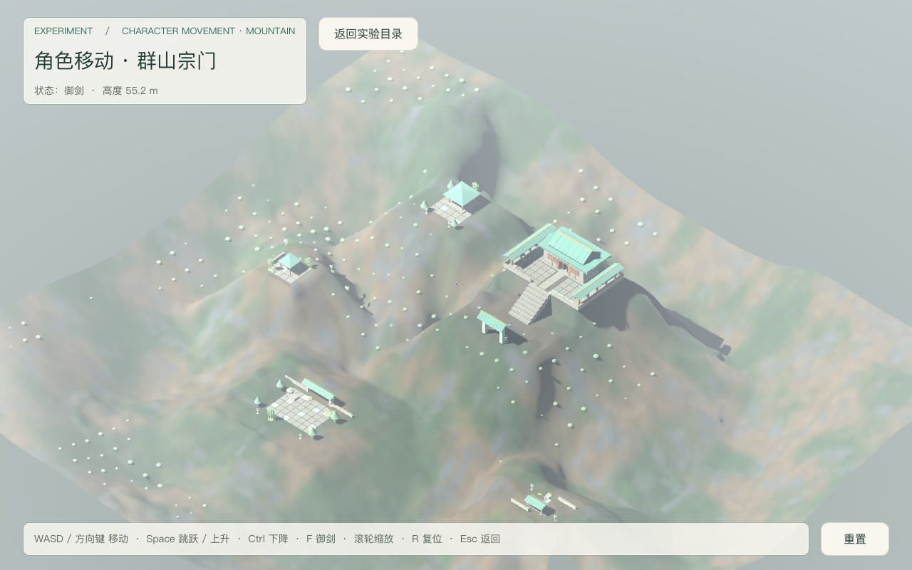
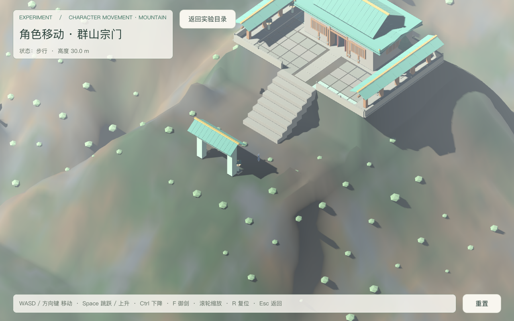
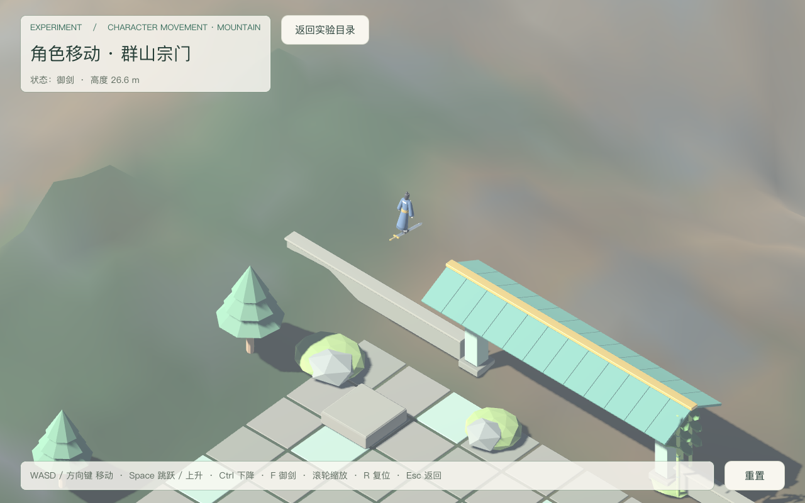
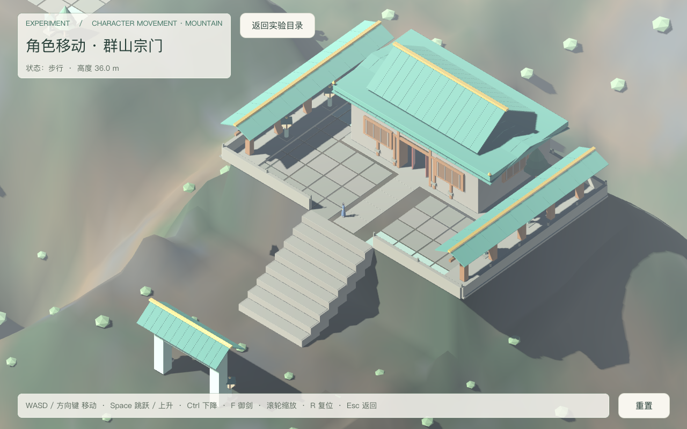
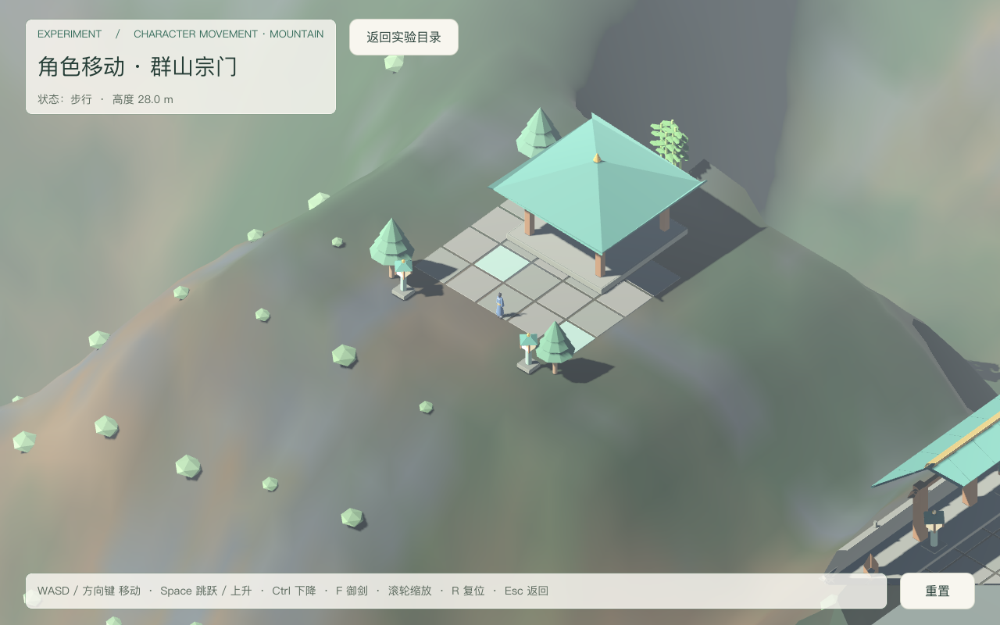
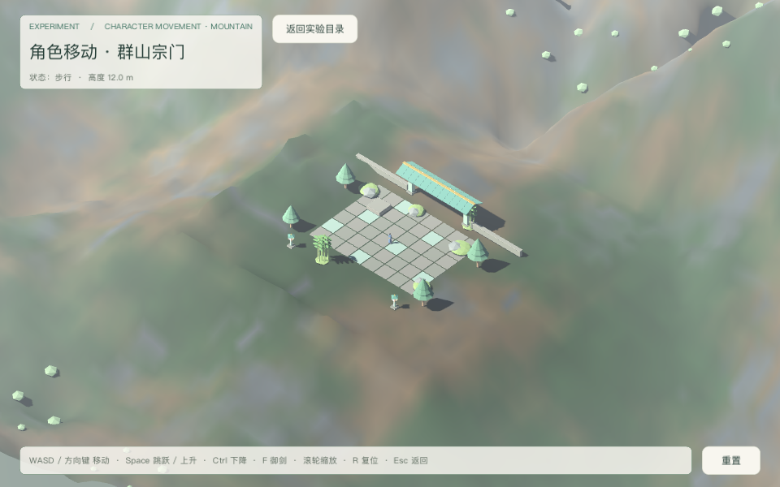
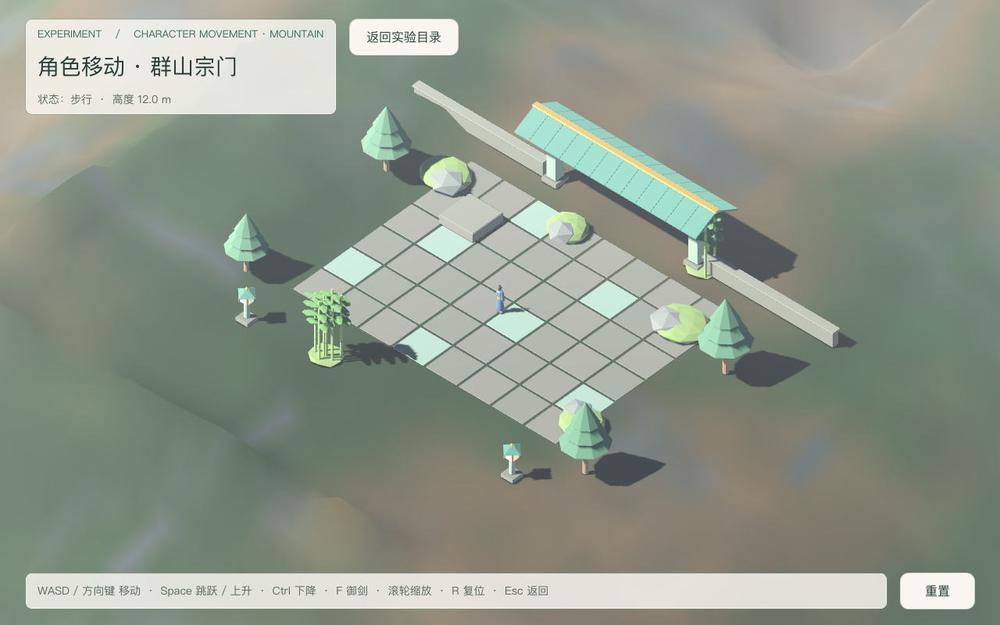

# 群山宗门视觉重建验收（2026-09-18）

场景：`res://levels/experiments/character_movement/mountain_realm.tscn`。
决策依据：[mountain-realm-visual-rebuild](../../notes/implemented/art/2026-09-18-mountain-realm-visual-rebuild.md)。
执行：独立验收代理独占全部 Godot 运行；父代理只审计日志 / 源码 / 图片。

## 最终摘要

- 真实物理集成矩阵：**210 项 PASS / 0 FAIL**（`mt-full.log`，单进程 18 个批次）。
  原 174 项对照全部保留行为语义；新几何适配后新增 36 项（入殿/出殿、谷地同源降落与行走、纯表现枢轴、庭院附加层、落点承载、地形阴影）。
- 运行时单元套件：**129 通过 / 0 失败**，stderr 0 行（`units.log`/`units.err`）。
- Tier 0 门禁 + 负向控制：全部通过，负向控制 **27/27**（`gates.log`）。
- 旧庭院回归：**33 PASS / 0 FAIL**；hub 回归：**13 PASS / 0 FAIL**。
- 截图共 **7 张**入仓 `docs/playtest/`：6 张行为截图（全貌 / 地面宗门 / 御剑近景 / 主峰降落 / 北峰降落 / 小窗）+ 1 张默认镜头（起点庭院，含树影）；飞行与降落画面全部由真实按键产生，捕获前打印 `SNAPSHOT`。
- 实测性能（环境集成代理的取证脚本只读运行，默认镜头 1280×800）：`PERF shot=default avg_fps=770.1 avg_frame_ms=1.30 samples=964`（`perf.log`，stderr 0 行）。
- 冻结资产：terrain visual `d8317dc6` / collision `ebc6e143`、人物 `70fc5eb6`、庭院 17 mesh + 33 盒。

## 五问分类

| 矩阵项 | 1 已实现 | 2 已运行通过（命令 + 日志） | 3 静态检查 | 4 未验证 | 5 外部阻塞 |
|---|---|---|---|---|---|
| G1 Tier0 + 负向控制 |  | ✔ 27/27（gates.log） |  |  |  |
| G2 运行时套件 |  | ✔ 129/129，stderr 0 行 |  |  |  |
| G3–G6 生成物 / 目录 / 场景引用 |  | ✔ verify 全通过 | ✔ 3 GLB preload 均存在 |  |  |
| G7 旧庭院 / hub 回归 |  | ✔ 33/33、13/13 |  |  |  |
| P1 装配（三能力/75 盒/5 壳/3 落点） |  | ✔ |  |  |  |
| P1b 落点承载（平台盒射线核验） |  | ✔ spawn 12.00 / summit 36.00 / north 28.00 |  |  |  |
| P1c 庭院附加层（33 盒 + 视觉） |  | ✔ 逐项注册、无重名 |  |  |  |
| P1d 地形阴影（唯一 Terrain 关投影、松树仍投影） |  | ✔ 1 个 Terrain OFF，36 个松树节点 ON |  |  |  |
| P2–P3 移动 / 方向键 / 斜向限速 |  | ✔ |  |  |  |
| P4–P6 跳跃 / 按住不连跳 / 空中不补跳 |  | ✔ |  |  |  |
| P7 低台阶站立 |  | ✔ |  |  |  |
| P8–P10 御剑开关 / 升降悬停 / 飞行快于步行 |  | ✔ |  |  |  |
| P11 撞山（新高度场外→内） |  | ✔ 西峰 / 东岭 / 前丘三处指定壳本体，行程被截断 |  |  |  |
| P12 撞楼 |  | ✔ 主殿南墙本体 + 顶墙 240 帧不穿透 |  |  |  |
| P13 两处山顶降落 |  | ✔ summit 36.00 / north 28.00 |  |  |  |
| P14 边界与高度上限 |  | ✔ |  |  |  |
| P15 掉出回收 |  | ✔ |  |  |  |
| P16 单物理提交点 |  | ✔ | ✔ 仅 actor 一处调用 |  |  |
| E1–E6 互斥 / 清账 / 失焦悬停 |  | ✔ |  |  |  |
| D1–D3 拆装 |  | ✔ |  |  |  |
| R1–R6 重置 / 退出 / 静态清账 |  | ✔ |  |  |  |
| **N1 入殿（新）** |  | ✔ 真实按键走 8 级台阶到 36 面、只在门洞 x∈[2,6] 穿墙、殿内脚底贴合 Δy=0.000 |  |  |  |
| **N2 出殿（新）** |  | ✔ 真实按键从门洞退回月台 |  |  |  |
| **N3 谷地同源降落（新）** |  | ✔ 脚下命中地形壳本体、脚底贴合（间隙 0.20 m 内）、行走全程不脱源 |  |  |  |
| **N4 纯表现枢轴（新）** |  | ✔ 2 腿 + 2 臂角度随时间变化且反相、停步不原地踏步、能力仍 3 个 |  |  |  |
| V1–V6 视觉取证 |  | ✔ 6 张；飞行/降落由真实按键；默认镜头另 1 张（perf-default） |  |  |  |
| V7 画面可读性 |  |  | ✔ 人工查看：天空渐变、雾、地形与庭院层次可辨 |  |  |
| V8 手感 / 审美 |  |  |  | ✔ 需使用者试玩 |  |

## 命令与日志（原始日志在 `~/.cache/game-xiuxian-lab/final-qa/`）

| 证据 | 命令 | 日志 / 结果 |
|---|---|---|
| Tier 0 + 运行时 | `python3 tools/verify/run_all.py --with-tests` | `gates.log`：门禁全部通过、27/27、129/129 |
| 群山物理矩阵（最终） | `Godot --headless --path src --script res://tests/mountain_traversal_playtest.gd` | `mt-full.log`：210 PASS / 0 FAIL；`mt-full.err` 仅掉出回收预期 WARNING |
| 庭院回归 | `Godot --headless --path src --script res://tests/character_movement_playtest.gd` | `garden.log`：33 PASS / 0 FAIL |
| hub 回归 | `Godot --headless --path src --script res://tests/lab_playtest.gd` | `hub.log`：13 PASS / 0 FAIL |
| 运行时单测 | `Godot --headless --path src tests/test_runner.tscn` | `units.log`：129 / 0；`units.err` 0 行 |
| 截图（6 张） | `Godot --path src --script res://tests/mountain_traversal_playtest.gd -- --capture-prefix=<abs> --shot=<name>` | `shot-{overview,sect,flight,summit,north,small}.log` 全部 exit 0 |

## stderr 精确说明

- `mt-full.err`（无头物理矩阵）：只有 1 条 `WARNING`——掉出回收用例主动把角色放在 `fall_out_y=-6` 之下（y=-10），场景按设计 `push_warning` 并回 spawn；这是断言前置，不修改生产代码、不吞 warning。共 5 行（含 `at:` 与 GDScript backtrace）。
- `units.err`（运行时单测）：**0 字节，无任何输出**。
- 窗口模式日志（`shot-*.log`/`perf.log`）中的 `OpenGL API 4.1 Metal … - Compatibility - Using Device: Apple - Apple M4 Pro` 是 Godot 在 **stdout** 打印的渲染后端启动横幅（兼容渲染器 + 设备名），**不是 stderr 警告、不是错误**；所有 `.err` 文件中都不含该行。
- 临时一次性探针脚本（`_probe_shells.gd`）已删除，其一次 `on_floor` 误用产生的 SCRIPT ERROR 只存在于已删脚本的 `probe5.log`，不属于交付测试；工作区与 git 状态中均无探针残留。

## 新几何适配（本轮测试侧改动，均不降断言）

1. 山体壳断言从「底座足印 AABB」改为「0→台顶垂直覆盖 + 覆盖自身台顶中心」——heightfield 后各峰侧壁与远脊不再与旧足印一致。
2. 撞山 sweep 起点改为**可站立的谷底**（先落地证明可站，再水平推进）；请求长度取完整 from→target 距离 +2 m，仍断言命中指定壳本体且 `travel < 请求长度`。
3. 东岭 sweep 曾因把请求长度硬编码 40 m 而够不到（实测需 42.98 m）——是测试驱动缺陷，已改为完整跨度；生产山体未改。
4. 谷地降落不再硬编码 y=0：新高度场谷底 0.4–18 m 不均匀，改为先射线探测目标点真实地面高度，再飞至其上方 4 m 关飞行落体，并核验脚下是地形壳本体。
5. 台阶爬升改为「平面到达 + `on_floor` + 高度贴合」才接受，避免跳跃途中假通过。
6. 向下射线统一排除角色自身胶囊，否则出生点正下方会误命中 Swordsman。

## 实际画面

人工观察（自动检查不替代）：天空为浅蓝渐变、地平线有雾，不再是纸白背景；地形有草土岩与坡脚过渡、非规则叠饼；庭院瓦顶 / 木构 / 灰米石铺在默认镜头下可辨；默认镜头可见松树投在地形上的阴影。手感与审美仍需使用者实机判断。

## 已知限制

- 地形为有限高度场，相机最大缩放 `CAMERA_SIZE_MAX = 170` 下取景仍可能有远端出框；本轮未做更大范围的全景取景验证。
- 谷地为自然坡面，实测同一谷区地面高度 0.4–18 m，不保证处处平坦；坡上行走会短暂离地（本测试以「间隙 < 0.6 m 且脚下始终是同源地形壳」判定贴合）。
- 角色无骨骼，步态为分件刚体摆动，脚掌无 IK 锁定；这是纯表现层，删除后物理不变。
- 地形主高度场关闭自身投影以消除自阴影条纹；树、灌木、建筑与角色仍投影。
- 手感与配色审美需使用者试玩；AI 程序建模非成品美术。

## 未通过项与归因

无未通过项。本轮测试侧修复的 6 处均为测试驱动缺陷（非生产缺陷），已在「新几何适配」记录；生产代码与资产未因测试而放宽。
