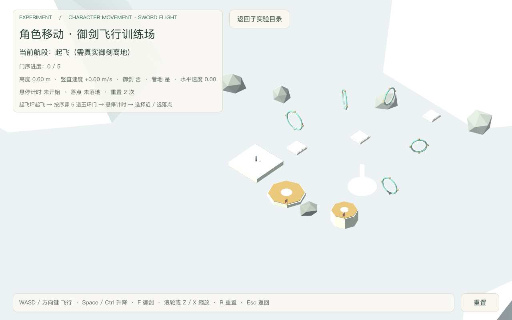
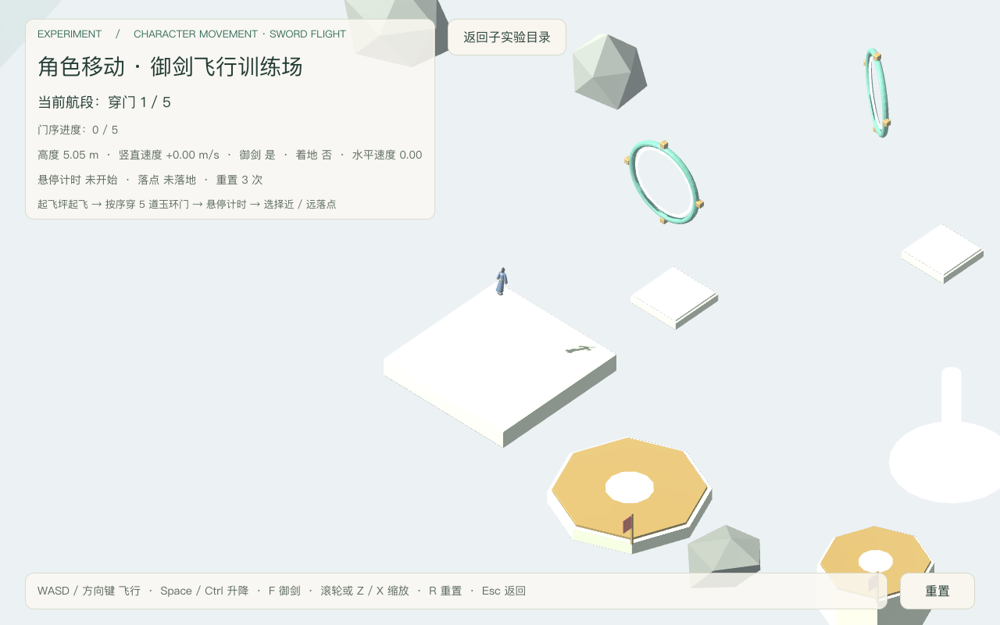
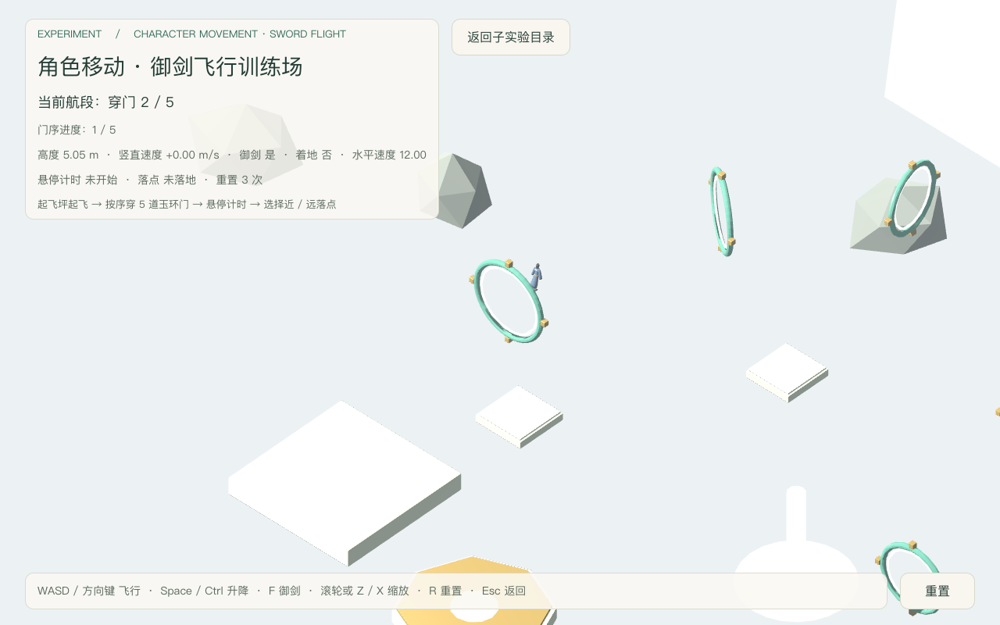
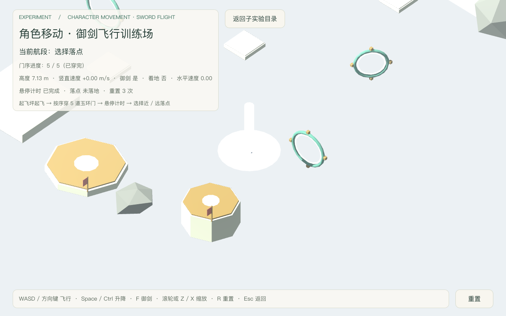
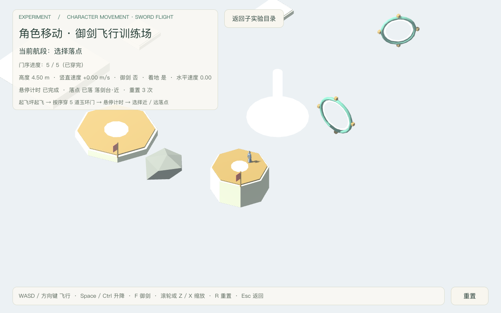
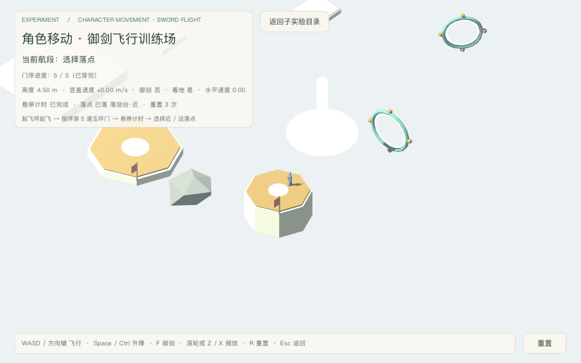

# 御剑飞行训练场验收（2026-09-18）

场景：`res://levels/experiments/character_movement/sword_flight_course.tscn`（可独立启动）。
决策依据：[character-movement-subexperiments](../../notes/implemented/gameplay/2026-09-18-character-movement-subexperiments.md)（子实验「御剑飞行训练场」）。
美术台账：[asset_ledger.md](../art/sword_flight_course/asset_ledger.md)。
验收档位：**CLI 档**（`godot --headless` + 真实键盘事件 + 窗口模式截图；编辑器桥不可用，未用 MCP）。

## 最终摘要

- 无头验收：**109 项 PASS / 0 FAIL**（原 93 项全部保留，新增 16 项掉出回收 / 清账断言）。
  stderr **非 0**：仅 4 行 + 2 行 backtrace 的**预期** `WARNING`——掉出回收用例主动把角色放到阈值之下，
  场景按设计 `push_warning` 并回收（`b1b2b3b.err`）。该 warning 是断言前置，未被吞掉、也不修改生产代码。
- 掉出回收（B1）：新增 `FALL_OUT_Y = -12.0` 与 `_check_fall_out()`，低于阈值即回收至起飞坪并计数；
  HUD 显示回收次数，`route_state()` 暴露 `fall_out_count` / `fall_out_y`。截图未受影响，无需重拍。
- 窗口截图批次：**0 FAIL**，6 张入仓（`2026-09-18-sword-flight-course-*.png`），stderr 仅 macOS 输入法提示 2 行（198 字节，非错误）。
- 运行时单测：**260 通过 / 0 失败**，stderr 0 字节（`units.log`）。
- Tier 0 门禁：全部通过，负向控制 **27/27**（`gates.log`）；verify-scenes 13 个目标全合规。
- 全航线由**连续真实飞行**完成：一次起飞、按序穿 5 道玉环门、悬停 2.52 s、真实落地，轨迹点 588；
  仅在独立子批次开头用 R 重置到起飞坪（子批次内部不重置、不传送）。

## 五问分类

| 验收项 | 1 已实现 | 2 已运行通过（命令 + 日志） | 3 静态检查 | 4 未验证 | 5 外部阻塞 |
|---|---|---|---|---|---|
| A1 场景装配（角色 / 组件 / 相机 / GLB / 碰撞根） |  | ✔ 109/0 |  |  |  |
| A2 路线数据（≥5 门、≥2 落点、高度递进再回落） |  | ✔ 逐项断言 | ✔ JSON schema 与生成器同源 |  |  |
| A3 碰撞与视觉同源、无隐形墙 |  | ✔ 86 盒全部装到场景节点；纯视觉件无碰撞登记 |  |  |  |
| A4 三能力原样 + 唯一物理提交点 |  | ✔ 运行时读回装配 | ✔ 仅 actor 一处 `move_and_slide` |  |  |
| A5 值域边界（不写 velocity/意图/组件字段、不引核心系统） |  |  | ✔ 正则扫描场景脚本通过 |  |  |
| A6 使用 MovementLabInput（WASD/方向键、Space/Ctrl、F） |  | ✔ 显式声明升降键 | ✔ |  |  |
| F1 真实起飞（F + Space 升到 4 m 以上） |  | ✔ |  |  |  |
| F2 Space 真实上升 / Ctrl 真实下降 |  | ✔ vy ±7.00 |  |  |  |
| F3 release 后真实悬停（vy≈0、高度稳定） |  | ✔ Δy=0.000 |  |  |  |
| G1 按序穿 5 门（真实飞行，无传送） |  | ✔ 门序 1→5 逐门读回 |  |  |  |
| G2 门序不可跳过 / 不可重复 |  | ✔ 每次断言 `gate_index == 期望` |  |  |  |
| G3 未御剑不算空中门 |  | ✔ |  |  |  |
| G4 环体真实参与碰撞 |  | ✔ 189 帧胶囊-环体接触 |  |  |  |
| G5 环体不可穿透 |  | ✔ 精确形状重叠帧数 0 |  |  |  |
| H1 悬停区累计满 2.5 s |  | ✔ 实际 2.52 s |  |  |  |
| H2 悬停前必须已按序穿完全部门 |  | ✔ |  |  |  |
| L1 近落点真实降落（台面 4.5 m） |  | ✔ on_floor y=4.50 |  |  |  |
| L2 远落点真实降落（台面 0.8 m） |  | ✔ on_floor y=0.80 |  |  |  |
| L3 落点判定记录正确并贴合台面 |  | ✔ landing_near / landing_far |  |  |  |
| E1 Space / Ctrl release 真实生效 |  | ✔ vy 归零 |  |  |  |
| E2 失焦清账且保留悬停 |  | ✔ 清输入、vy=0、高度稳定、不坠落 |  |  |  |
| E3 F echo 不重复切换 |  | ✔ 4 次 echo 后仍御剑 |  |  |  |
| E4 R 关闭御剑并清空 `sword_flight_block` |  | ✔ count=0 |  |  |  |
| E5 掉出回收触发并计数 |  | ✔ `fall_out_count` 0→1 |  |  |  |
| E6 回收走公开清账（输入 / 御剑 / 阻塞 / 意图 / 速度） |  | ✔ 全部归零，落回坪面静止 |  |  |  |
| E7 回收后路线状态归零且可再次起飞 |  | ✔ 门序 / 悬停 / 落点 / 航段归零，复飞成功 |  |  |  |
| E8 悬停判据唯一来源 `HOVER_TICK_TOLERANCE` |  | ✔ 无 `0.35` 漂移字面量 | ✔ 全文检索确认 |  |  |
| R1 Esc 返回 movement_lab_hub |  | ✔ 实际 `MovementLabHub` |  |  |  |
| R2 返回后 MSAA 恢复进入前值 |  | ✔ |  |  |  |
| V1–V5 截图五类（全景 / 起飞 / 穿环 / 悬停 / 落点） |  | ✔ 6 张（含小窗） |  |  |  |
| V6 画面可读性（HUD 数据与地形层次） |  |  | ✔ 人工查看 6 张 |  |  |
| H3 飞行手感 / 路线难度 / 审美舒适度 |  |  |  | ✔ 需使用者试玩 |  |

## 命令与日志

原始日志在 `~/.cache/game-xiuxian-lab/sword-flight-course/`（不入仓）：

| 证据 | 命令 | 结果 |
|---|---|---|
| 无头验收 | `Godot --headless --path src --script res://tests/sword_flight_course_playtest.gd` | `b1b2b3b.log`：**109 PASS / 0 FAIL**；`.err` 仅掉出回收预期 WARNING |
| 无头验收（B1/B2/B3 前基线） | 同上 | `headless11.log`：93 PASS / 0 FAIL；`.err` 0 字节 |
| 截图 6 张 | `Godot --path src --script res://tests/sword_flight_course_playtest.gd -- --capture-prefix=<abs>` | `capture3.log`：0 FAIL；`SNAPSHOT` 逐张打印 |
| 运行时单测 | `Godot --headless --path src tests/test_runner.tscn` | `units.log`：260 / 0，stderr 0 字节 |
| Tier 0 + 负向控制 | `python3 tools/verify/run_all.py` | `gates.log`：全部通过，27/27 |
| 场景门禁 | `python3 tools/verify/verify_scenes.py` | 13 个目标全部合规 |
| 资产生成 | `Blender --background --factory-startup --python tools/art/generate_sword_flight_course.py -- course` | `blender-course2.log`：objects=60 tris=7320 colliders=86 |

## 运行时读数（截图批次 SNAPSHOT）

| 截图 | 航段 | 门序 | 悬停 | 御剑 | 着地 | 位置 | 落点 |
|---|---|---|---|---|---|---|---|
| overview | 起飞 | 0/5 | 0.00 | 否 | 是 | (0.00, 0.60, 11.00) | — |
| takeoff | 穿门 | 0/5 | 0.00 | 是 | 否 | (0.00, 5.05, 11.00) | — |
| gate | 穿门 | 1/5 | 0.00 | 是 | 否 | (0.42, 5.05, -3.59) | — |
| hover | 选择落点 | 5/5 | 2.52 | 是 | 否 | (30.41, 7.13, 6.84) | — |
| landing | 选择落点 | 5/5 | 2.52 | 否 | 是 | (30.27, 4.50, 11.70) | landing_near |

## 实际画面

人工观察（自动检查不替代）：HUD 在 1280×800 与 960×640 下完整、未遮主要航线；HUD 实时显示航段、
门序进度、高度 / 竖直速度 / 御剑 / 着地 / 水平速度、悬停计时与落点结果，与截图场景一致；
玉环门、云阶、落剑台、悬浮石与远山在画面上层次可辨。

## 本轮发现与修复（均为本实验自身缺陷）

1. **按键只在 idle 帧派发**：驾驶循环原只等 `physics_frame`，真实键盘事件永不生效，首跑全航线坠地（y 达 -4 万米）。改为每步等"物理帧 + idle 帧"（`_tick()`）。
2. **协程未 await**：`_reset_route()` 含 `await`，但 11 处调用都没 await，重置在断言前就返回，后续批次跑在旧状态上。已全部补 await。
3. **角色原点在脚底**：胶囊中心相对原点高 0.8 m，而门 / 悬停判定是"身体中心"语义。对准环心时整体低 0.8 m，窄门（半径 1.8 m）必然撞环体下缘。场景新增 `BODY_CENTER_OFFSET` 与 `_body_center()`，验收脚本同步按身体中心瞄准；落点仍按脚底（脚踩台面）。
4. **落点分支不可达**：`_update_route` 的 `elif _phase == "gates"` 先匹配，`elif _phase == "landing"` 永远进不去，落点判定从未执行。已改为在 `gates` 分支内也调用（落点与门序 / 悬停相互独立）。
5. **落点状态晚一帧**：父节点 `_physics_process` 先于子节点，落地那一帧场景尚未读到 `on_floor`。验收侧落地后多等 4 帧再读结果。
6. **掉出无回收（B1，生产缺陷）**：关飞后飞出航路会无限下坠，场景完全没有回收路径。已按上文新增 `FALL_OUT_Y` + `_check_fall_out()`（复用公开清账 + 计数 + HUD/warning）。
7. **悬停判据漂移（B2，生产缺陷）**：改前 `HOVER_TICK_TOLERANCE` 声明未用、判据被硬编码为 `0.35`；现改为唯一来源 `HOVER_TICK_TOLERANCE`（当前 0.12）。
8. **测试判据缺陷（两处，均已修正且不放宽）**：
   - `Node.get_path()` 返回**绝对**路径（`/root/...`），原按相对前缀比较导致"环体接触"恒为 0 帧；改为按节点名判断。
   - "环体不可穿透"原断言"停在环体某一轴向位置"——但环体是**细圆环**，胶囊正面撞上后沿切向滑开是正确物理结果。改用**精确形状查询**判据：以角色真实胶囊（放大 5 cm）探测"是否与环体接触"、以等尺寸探测"是否重叠"。
9. **掉出回收用例的两处测试侧缺陷（B3 新增断言时暴露，均为测试自身问题）**：
   - 回收后断言"当帧速度为 0"会误判正常情况：`reset_motion` 清零速度后，角色从略高于坪面的回收点
     受重力正常下落。改为断言"**落回坪面并静止**"。
   - 场景 `_clear_pressed()` 清的是 helper 状态，测试自己的按住账本未复位，导致 `_sync_keys` 认为
     Space 仍按着而不重发按下事件，复飞假失败。改为测试侧同步复位后再复飞。

## 关于"环体不可穿透"的判定依据（重要）

细圆环无法像墙面那样"挡住就停"：胶囊接触环体后会被真实碰撞推开并沿切向滑走。因此本实验**不断言**
"停在某处"，而断言两件真正等价、且无法用假动作通过的事：

- **环体真实参与碰撞**：以真实胶囊放大 5 cm 做形状查询，必须在飞行过程中命中环体块 → 实测 **189 帧接触**；
- **环体不可穿透**：以等尺寸胶囊查询，与环体块的重叠帧数必须为 **0** → 实测 **0**。

独立诊断探针（存放于仓库外，未入 Git）测得胶囊表面到环体块的**最小距离 0.351 m**，与胶囊半径
0.350 m 一致，即相切而非穿透；实测"停在环体外侧"的旧断言失败是**判据写错**，不是碰撞缺失。
环壁 16 块 / 圈、块间距 0.48–0.94 m 均小于胶囊直径 0.70 m，不能从环壁缝隙钻过。

## 掉出回收（B1）

关飞后若飞出航路而没有可落脚台面，角色会一直下坠。新增回收：

- 阈值 `FALL_OUT_Y = -12.0 m`：起飞坪台面 0.6 m、最低落点台面 0.8 m，因此该值远低于任何可玩高度，
  不会误伤正常飞行与降落。
- 回收路径**全部复用既有公开接口**：`clear_input`（经 helper）→ `reset_motion`（清输入 / 边沿 /
  速度 / 意图，并置 `flight_active=false`，`sword_flight_block` 由 SwordFlight 的失活路径清账）→
  回起飞坪 → 复位朝向 → 路线状态（门序 / 悬停 / 落点 / 航段）归零。**不写组件或能力内部状态。**
- 可观察性：每次回收 `push_warning` 一条带高度与次数的警告；HUD 常显「掉出回收 N 次（低于 -12 m）」；
  `route_state()` 暴露 `fall_out_count` / `fall_out_y`，验收脚本据此断言计数与清账。
- 与手动 R 重置**分开计数**，便于区分"玩家主动重置"与"飞丢了"。

## 悬停判据唯一来源（B2）

改前原实现声明了 `HOVER_TICK_TOLERANCE` 却未使用，判据被写成字面量 `0.35`——调参只会改一半。
现已改为唯一来源 `HOVER_TICK_TOLERANCE = 0.12`：悬停要求「区内 + 御剑 + `|vy| ≤ 该值`」。
该阈值收紧后，悬停仍实测累计 **2.52 s** 通过（`_run_flight_route` 与截图批次均通过）。

## 已知限制

- 未做镜头遮挡规避与自动构图；相机为固定偏移平滑跟随 + 手动缩放，不做 camera_lab 的策略对比。
- 掉出回收只覆盖"低于阈值"这一种飞丢情形；水平飞出 bounds 仍由相机跟随钳制，不做额外围栏。
- 灰盒观感为程序化几何（青玉环 + 素石台），无角色动画、无音效、无天气。
- 远山与悬浮石为纯视觉、无碰撞。
- 悬停计时按"区内 + 御剑 + `|vy| ≤ HOVER_TICK_TOLERANCE`"（当前 = 0.12 m/s）判定；
  贴地悬停不算失败但会让计时归零重来（有意如此，避免作弊）。
- 路线难度与飞行手感需使用者试玩；AI 程序建模不等于成品美术。

## 未通过项与归因

无未通过项。审查 B1–B3 落地后：生产侧修复 2 处（掉出无回收、悬停判据漂移），
验收侧修复 4 处（2 处前轮已记录 + B3 暴露的 2 处测试自身缺陷），全部复跑至 **109 PASS / 0 FAIL**。
生产碰撞从未为让测试通过而放宽；掉出回收 warn 保持原样、未吞掉。
