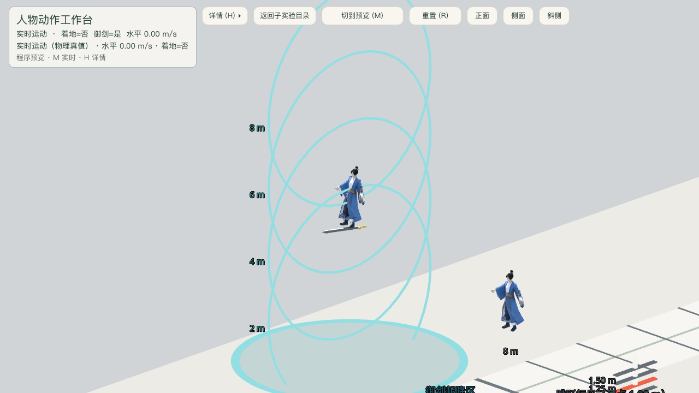

# 飞剑朝向适配验收

日期：2026-09-19
场景：`res://levels/experiments/character_movement/motion_stage.tscn`

## 结论

PASS。人物继续使用已经由使用者确认正确的局部 `+Z` 正面；原始飞剑 GLB 的剑尖为局部
`-Z`，通过共享视觉适配根绕 Y 轴 180° 后，剑尖与人物正面一致。正式 `FlightBundle` 与
动作预览都实例化同一个 `flying_sword_visual.tscn`，没有分别写旋转，也没有覆盖原 GLB。

## 机械证据

- `test_flight_bundle.gd`：正式装配根局部 yaw 为 180°；内部保留 `FlyingSwordModel`；
  原 GLB 的局部 `-Z` 剑尖经两级 basis 变换后与人物局部 `+Z` 点积大于 0.999。
- `test_motion_preview.gd`：预览装配执行同样三项断言，避免正式与预览再次漂移。
- 运行 `tests/test_runner.tscn`：1092 通过，0 失败。
- 截图脚本通过真实输入进入正式御剑状态并由真实渲染帧保存图片；脚本报告 0 失败。

## 截图

斜侧机位下，人物面朝画面左侧，银灰剑尖也朝画面左侧；金色剑柄位于人物后方。人物与剑的
前后方向一致，且剑仍位于足下。



截图实际像素：1280×720。

## 命令

```sh
/Applications/Godot.app/Contents/MacOS/Godot --headless --path src tests/test_runner.tscn

/Applications/Godot.app/Contents/MacOS/Godot --path src \
  --script res://tests/motion_stage_playtest.gd -- \
  --capture-prefix=/absolute/repo/docs/playtest/2026-09-19-flying-sword-facing \
  --shot=flight --canvas=1280x720
```

Godot AI 会话列表在本轮为空，因此按 `godot-ai-orchestration` 的无会话回退约定使用 CLI；
截图来自窗口渲染器（OpenGL/Metal Compatibility），不是无头占位图。
