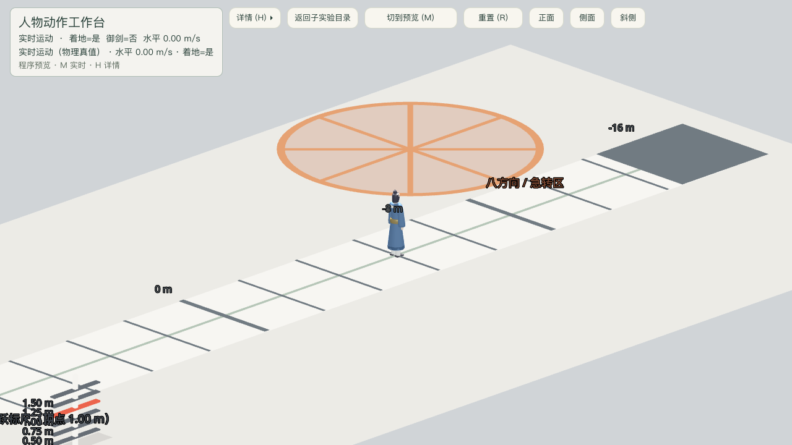

# 共享移动场景 Blender 角色回退验收

日期：2026-09-19

## 结论

PASS。除青玉纸样板显式替换的 v7 角色外，默认 `Swordsman` 和动作预览经共享
`cultivator_visual.tscn` 重新加载 Blender 原创 `cultivator.glb`，不再加载宽袖袍
`cultivator_jade.glb`。角色物理、程序动作、正面轴和飞剑装配没有改变。

## 证据

- `test_motion_preview.gd` 从运行时节点读回模型实例 `scene_file_path`，等于
  `res://game/actors/swordsman/models/cultivator.glb`。
- `test_jade_paper_rigged_animation.gd` 继续验证青玉纸样板使用独立 v7 视觉链。
- `tests/test_runner.tscn`：1094 通过，0 失败。
- 动作工作台窗口渲染截图成功，截图脚本 0 失败。



截图实际像素：1280×720。

## 命令

```sh
/Applications/Godot.app/Contents/MacOS/Godot --headless --path src tests/test_runner.tscn

/Applications/Godot.app/Contents/MacOS/Godot --path src \
  --script res://tests/motion_stage_playtest.gd -- \
  --capture-prefix=/absolute/repo/docs/playtest/2026-09-19-shared-blender-character \
  --shot=idle --canvas=1280x720
```
