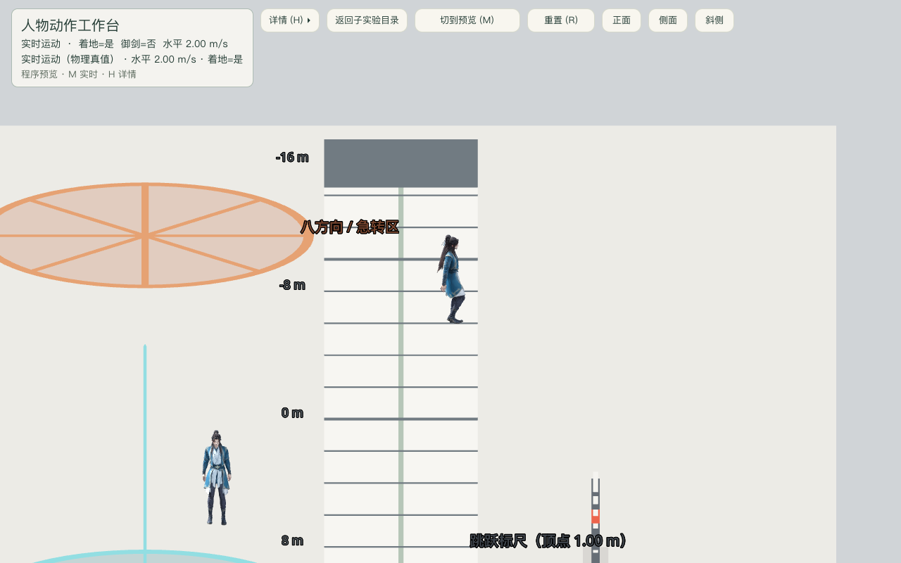
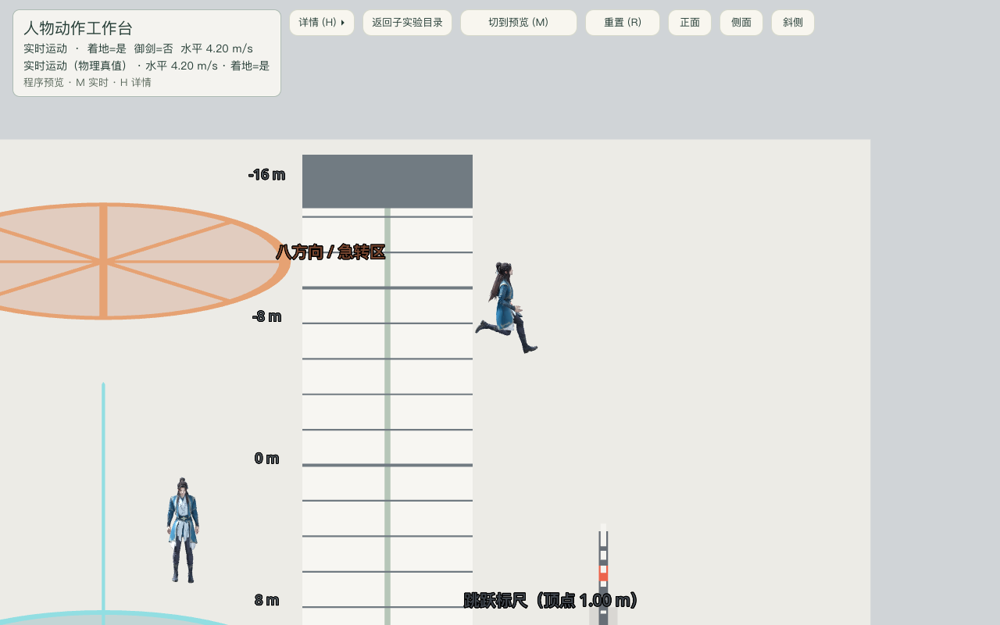
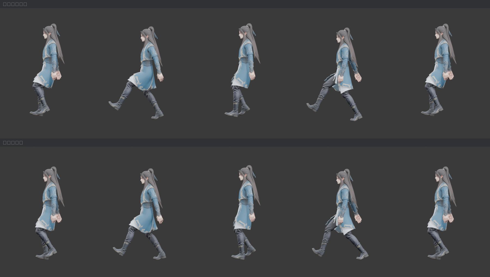

# 走路重心与共享移动提速验收

日期：2026-10-06。Godot 4.6 stable / Compatibility，Blender 5.2.1 LTS，Apple M4 Pro。

## 改动

保留现有人物，修正 walk 腿链相对骨盆的摆动中心、鞋底支撑高度和新动作循环闭合。全周期双踝前移从 12.69 cm 降到 0.76 cm；上身自然摆动保留。121 次含亚帧采样的鞋底高度从最高约 10.6 cm 悬空，收敛到 -3.1–3.5 mm。默认角色、动作预览和十个三维移动场景共用同一视觉与运动参数。

| 能力 | 改前 m/s | 改后 m/s | 提升 |
|---|---:|---:|---:|
| 普通步行 | 1.25 | 2.0 | 60% |
| Shift 疾跑 | 2.25 | 4.2 | 86.7% |
| 御剑水平 | 12 | 22 | 83.3% |
| 御剑上下 | 7 | 12 | 71.4% |

跳跃初速 / 重力仍为 6 / 18。理论平地跳跃时长 0.667 秒、疾跑跳跃水平距离从 1.50 到 2.80 米。以相同 1/60 秒固定步长积分，10 米走路从 8.0 到 5.0 秒、跑步从 4.45 到 2.383 秒、直升 40 米从 5.717 到 3.333 秒；不含转向、碰撞和起飞窗口。数据见 [speed_before.json](speed_before.json)、[speed_after.json](speed_after.json)。

## 自动检查

- `Godot --headless --path src --import`：成功导入新角色资产。
- `python3 tools/verify/run_all.py --with-tests`：Tier 0 全部通过，负向控制 27/27，运行时测试 1658 通过、0 失败。含十场景疾跑 150 项、十场景移动/跳跃/御剑 333 项、西湖 33 项。
- 走路重心、首尾闭合、蒙皮贴地、上身姿态、朝向/摆臂工具：导出测量通过，见[台账](../../art/cultivator_balanced_motion_20261006/asset_ledger.md)。原版保留作测量对照。
- 保存后的 Blender 源单独重导出：精确七段 clip、22 骨、三张贴图内嵌；重导出七段贴地检查通过。
- 云层验收按共享上升速度计算输入时长，实际连续 Space 上升进入约 39 米云中，再上升至约 60 米云上；未沿用旧速度的固定帧数。

完整结果：[checks.txt](checks.txt)。

## 真实窗口输入

运行：

```sh
Godot --path src --script res://tests/motion_balance_playtest.gd -- --capture-prefix=/绝对仓库路径/docs/playtest/2026-10-06-motion-balance/motion
```

38 项通过、0 失败，日志 [window_input.txt](window_input.txt)。全部移动由 InputEventKey 进入现有输入层，没有写速度或传送摆拍。每个八方向样例之间使用场景原有 R 重置，截图以侧面横移检查步态。

- 八方向实际速度均为 2.0，视觉根朝向与真实水平速度归一化点积大于 0.999；都播放 walk。
- 普通走路播放器速率约 1.206；按 Shift 进入 run，速度 4.2、播放约 0.994。
- 疾跑中 Space 离地，切入 jump。
- F 御剑，W+Space 水平 22 / 竖直 12；Ctrl 下降 -12，仍为 sword_ride。
- 真正绘制的 idle / walk / run / jump / flight 五张截图均保存成功，场景释放后正常退出，无 ERROR / 资源泄漏诊断。







## 边界

测量验证重心、贴地、朝向和播放契约；走跑是否达到使用者期望的自然感仍需实际试玩判断。参考速度是支撑阶段的骨骼估计，当前没有逐接触点脚锁定 / IK，不能承诺完全消除所有阶段的滑步。人物服装网格与原有六段动作均保留。
